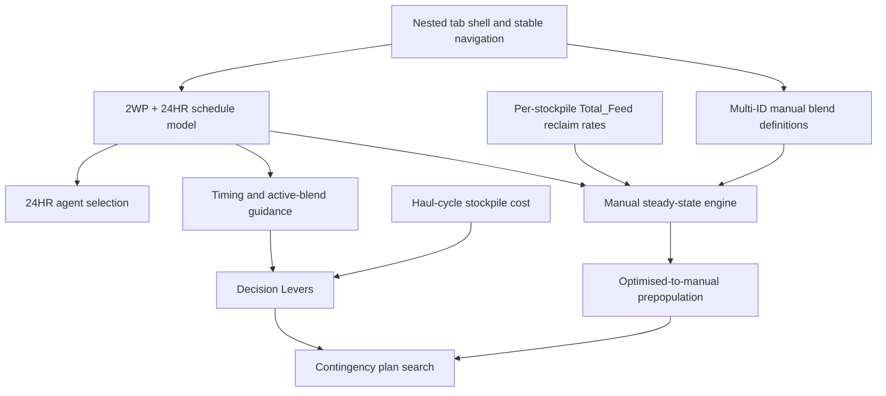

# BlendMaster Ultimate

> Source code in C:\BlendMaster\blendmaster_OOP. We are going to take this app to the next level. We are not going to start writing code right now. We are going to understand the code base, the tasks and the dependencies between the tasks to determine the order in which these should be done. I will then prompt separately for each task and validate results after each task is complete. Here are the tasks: 	• Imported APS Mining.csv schedules
> 		○ Currently only 2WP is imported
> 			§ 2WP used as product brand guidance
> 			§ 2WP used to populate build tonnes and grades
> 			§ 2WP used to create expit payload transactions
> 		○ To be done: 2WP and 24HR are both imported
> 			§ Ingesting the data
> 				□ 24HR plan is used to create expit payload transactions
> 					® For each source grade block in 24HR schedule, the destination needs to be looked up from the 2WP
> 						◊ If a grade block is sent to more than one destination, this needs to be handled properly when ingesting the 24HR schedule data. For example, if a grade block is sent to 2 destinations in the 2WP but there is only 1 transaction for it in the imported 24HR schedule, then this 1 transaction needs to break into two with source tonnes proportioned based on the destination ratios derived from the 2WP
> 				□ 2WP used as brand guidance - no change from current implementation
> 				□ 2WP used to populate build tonnes and grades - no change from current implementation
> 				□ 2WP used as a source stockpile timing guidance
> 					® This is new. We want a source stockpile to now carry two layers of guidance:
> 						◊ Brand
> 						◊ Time. Example: If stockpile was used as a feed source between certain dates in the 2WP guidance then reward if BlendMaster uses the stockpile within the window (plus a user input tolerance) or penalise if not used within the window
> 				□ 2WP guidance active blend
> 					® When ingesting 2WP Mining.csv, we also need to identify the active stockpile blend into each product brand and the duration of time the blend was active for
> 						◊ The reward BlendMaster if it uses the same blend as the 2WP guidance at the same time and penalise it otherwise
> 	•  Setup Blends (Manual)
> 		○ Currently a stockpile can be assigned only 1 Blend ID
> 			§ We need to allow a stockpile to be assigned more than 1 Blend ID
> 			§ But the rule is, only one of the blends with overlapping stockpiles can be used in the Blend Sequence (Manual Gantt) at a time
>
> 	• Introduce Steady States and Direct Tips in the manual blend sequencing flow
> 		○ Implement based on optimised flow
> 		○ We need the same kind of events as the optimised flow to trigger a steady state / decision point in the manual flow, generate transactions similar to the optimised_blend_report and call it manual_blend_report
> 		○ We will then need to allow direct tip to become visible in each steady state and use pick and choose from the UI (maybe from a list of available grade block sources and their tonnes and grades) how many tonnes (aggregated payloads) they are gonna use
> 		○ The ratio of direct tip + stockpile feed will need to add up to 100% and the combined feed will determine the output tonnes and grades
>
> 	• Screen flow
> 		○ Currently BlendMaster has multiple tabs from left to right
> 			§ Some of these tabs are setup tasks whereas others are where users would spend most of their time
> 			§ We need to separate the two in the best that the PyQT allows - ideally tabs and sub-tabs.
> 				□ Site Config, Stockpile Inventories, Solver Config are setup, group them under a Setup tab
> 				□ A new Workspace parent tab
>
> 					® AMT Stockpiles
>
> 					® Auto Blend tab
> 						◊ Product Build Settings
> 						◊ Decision Levers (new tab described below)
> 						◊ Calendar
> 						◊ Decision Point
>
> 					® Manual Blending Dashboard tab
> 						◊ Setup Blends (Manual) - rename to Setup Blends
> 						◊ Blend Sequence (Manual Gantt) - rename to Blend Sequence
>
> 				□ Output charts and reports are grouped under a new parent Results tab
> 					® Results (rename to Optimised Blend Sequence)
> 					® Grade Profiles
> 					® Reports (allow a SQL line entry to query the columns we want and default to Select * Limit 100 for every table)
>
> 	• Additional stockpile property for scenarios using Total_Feed crushers
> 		○ When using Total_Feed crushers we need to get an additional property for each stockpile in the Stockpile Inventories
> 			§ Max Reclaim Rate
> 		○ We will then need to disable the Max Reclaim rate in the calendar for such scenarios and use the input per footprint from Stockpile Inventories instead
>
> 	• Exposing fewer / simpler solver inputs to the user in a new Decision Lever tab and keeping the current (and additional) Solver Configuration in the Setup tab. The Solver Configuration will be exposed to certain users in the final web app implementation (you don't need to worry about roles)
> 		○ Ming and Max stockpiles - take to Decision Levers
> 		○ Min Stockpile Contribution Ratio - remains in Solver Configuration in Setup
> 		○ Min Stockpile Feed Duration  - remains in Solver Configuration in Setup
> 		○ Blend Option Timeout - remains in Solver Configuration in Setup
> 		○ Max Blend Options per Steady State - take to Decision Levers
> 		○ Stockpile Blend Feasibility - take to Decision Levers
> 		○ Off-spec steady states are allowed if ultimate build is on spec - remains in Solver Configuration in Setup
> 		○ 2WP Product Guidance - take to Decision Levers (no need for a drop down, make it a check box, ticked is equivalent to the current "prefer matching product brand" option from drop down; Incentive / penalty input for 2WP Product Guidance - remains in Solver Configuration in Setup
> 		○ Enable Direct Tip - take to Decision Levers; Direct Tip Incentive - remains in Solver Configuration in Setup
> 		○ Stay on Same Blend Incentive - remains in Solver Configuration in Setup
> 		○ New incentives based on new 2WP guidance implementation described above
> 			§ 2WP Active Blend Reward - check box on Decision Levers; incentive value in Solver Configuration in Setup
> 			§ 2WP Source Stockpile Timing Compliance - check box on Decision Levers; incentive value in Solver Configuration in Setup
> 		○ All configurations under Direct Tip Commitment remain in Solver Configuration in Setup and not exposed to Decision Levers
> 		○ Prefer using fewer stockpiles - take to Decision Levers; this also needs an incentive input in Solver Configuration in Setup (the incentive value might be currently hardcoded?)
> 		○ Balance Preference  - take to Decision Levers; this also needs an incentive input in Solver Configuration in Setup (the incentive value might be currently hardcoded?)
> 		○ Prefer AMT stockpiles before weighted average inventory stockpiles - rake to Decision Levers; this also needs an incentive input in Solver Configuration in Setup (the incentive value might be currently hardcoded?)
> 		○ Try blending contaminated stockpiles/chunks first - take to Decision Levers; this also needs an incentive input in Solver Configuration in Setup (the incentive value might be currently hardcoded?)
> 		○ Try blending low grade stockpiles/chunks first - take to Decision Levers; this also needs an incentive input in Solver Configuration in Setup (the incentive value might be currently hardcoded?)
>
> 	• Prepopulating Manual Blending Gantt
> 		○ When steady states and direct tip are implemented in the manual blending path as described, we will then need to prepopulate the Blend Sequence (Manual Gantt) based on optimised blend results
>
> 	• Enabling / disabling expit dig circuits from imported 24HR Mining.csv
> 		○ Get all distinct agent names and list them on Site Configuration, the user selects the agents it wants to import and process for expit payload transactions
>
> 	• Stockpile Cost wired into Haul Infinity Cycle time
> 		○ New files need to be ingested (detailed on header names and how to ingest the file will be provided later)
> 			§ 2WP Haul Infinity Cycles.csv
> 			§ List distinct crusher names from a destination name column
> 			§ User selects the crushers
> 			§ We look up cycle time for each stockpile to each crusher, the smallest cycle time is the closest crusher to the stockpile
> 				□ A new column on the Stockpile Inventories tab needs to display the "Nearest Crusher" or "Closest Crusher" (whichever term makes more sense) based on the smallest cycle.
> 				□ The cycle time (minutes per cycle) needs to be penalised when optimisation is selecting stockpiles for a blend
> 					® Closer stockpiles to the crusher cost less
> 					® Further stockpiles to the crusher cost more
> 				□ This can be wired into the existing Cost per stockpile exposed in the calendar. However, the existing Cost input is in $/t so we need a way to link this cycle time penalty to the existing Cost input that translates to the longer the cycle time the higher the cost per tonne from that stockpile.
> 				□ This Cost input can then be removed from the calendar and instead we will have a new option in Decision Levers to enable / disable Rehandle Cycle Time Penalty. This also needs a cost input in Solver Configuration in Setup
>
> 	• Contingency blend plans
> 		○ Currently, the app can either interact with user or select the top ranking blend choice at every decision point
> 		○ We need the ability to produce contingency blend plans by selected the second, third etc best options at each decision point
> 		○ We need to get a user input in Site Configuration on how any Contingency Plans are required
> 		○ Based on this input, we need to produce separate outcomes / results sets and allow the user to switch between then and optionally prepopulate the manual blending dashboard with one
> 		○ Since a choice can have an impact on the options that become available later we need to put logical behaviour over this
> 			○ For example we don’t want it to select blend option 2 in the first decision point and then go back to the blend option 1 in the second decision point. So when producing contingency blend plans, the blends used in the parallel blend / contingency plans should not be reused / or should be penalised.

3 previous messages

> I’ll map the current architecture, data flows, UI composition, solver configuration, and reporting paths, then tie each requested task to concrete modules and sequence them by dependency. I’ll keep this strictly read-only—no source changes.
>
> The repository is a compact but highly centralized PyQt application: most UI and workflow state lives in a single ~9,200-line window class, while optimisation, APS ingestion, persistence/reporting, and manual blending are split into dedicated modules. I’m now tracing the actual state passed across those boundaries so the sequencing reflects code dependencies, not just feature wording.
>
> Two important dependency findings are now clear. First, manual blending is currently a separate scheduling/visualisation path—not a second mode of the optimisation transaction engine—so manual steady states/direct tip require a shared domain service, not a UI-only enhancement. Second, the current APS destination fallback deliberately collapses each grade block to one stockpile; the requested 24HR split must replace that with a conserved, ratio-based one-to-many allocation derived from 2WP.

I’ve completed a read-only architectural review. No source files were changed. The existing 19-test suite passes; the pre-existing `tests/` directory is currently untracked in Git.

## What exists today

The application has five principal layers:

- [InitialiseGUI.py](/C:/BlendMaster/blendmaster_OOP/GUI/InitialiseGUI.py:162) is a ~10,000-line PyQt controller containing tabs, workflow state, project persistence, scenario switching, and most input validation.
- [ExpitDataHandler.py](/C:/BlendMaster/blendmaster_OOP/classes/ExpitDataHandler.py:10) reads one Mining.csv and creates payload-level transactions.
- [Run.py](/C:/BlendMaster/blendmaster_OOP/execute/Run.py:61) connects the UI, schedule ingestion, model objects, optimiser, and reports.
- [CaseModeller.py](/C:/BlendMaster/blendmaster_OOP/classes/CaseModeller.py:191) owns the optimised steady-state loop and decision-point selection.
- [Optimizer.py](/C:/BlendMaster/blendmaster_OOP/classes/Optimizer.py:370) builds and solves the PuLP model.
- Manual blending is a separate configuration/Gantt/grade-profile path in [InitialiseGUI.py](/C:/BlendMaster/blendmaster_OOP/GUI/InitialiseGUI.py:8129) and [ManualBlendDash.py](/C:/BlendMaster/blendmaster_OOP/GUI/ManualBlendDash.py:700). It does not currently use `CaseModeller`, generate transactions, or write a manual blend report.
- SQLite reporting is centralized in [SQLiteDatabase.py](/C:/BlendMaster/blendmaster_OOP/database/SQLiteDatabase.py:33).

Important current details:

- One Mining.csv currently supplies both stockpile-build transactions and optional direct-tip candidates.
- The grade-block fallback in [ExpitDataHandler.py](/C:/BlendMaster/blendmaster_OOP/classes/ExpitDataHandler.py:520) intentionally chooses only the highest-tonnage 2WP destination. This is the exact logic that must become one-to-many ratio allocation.
- Product-build tonnes and grades currently come from Snowflake `PLANNING_PLAN_DATA`, not the selected Mining.csv, through [PlanningPlanTargets.py](/C:/BlendMaster/blendmaster_OOP/setup/PlanningPlanTargets.py:127). That distinction should remain unless the requirement changes.
- Stockpiles share one calendar reclaim rate. Per-stockpile rates are not represented in `StockpileData` or `EventData`.
- Balance, AMT, contamination, and low-grade preferences share a hardcoded `$1/t` tie-break reward; “fewer stockpiles” uses a hardcoded binary penalty of `10` in [Optimizer.py](/C:/BlendMaster/blendmaster_OOP/classes/Optimizer.py:36).
- Project format version 2 stores tab enabled states by numeric index. Nested tabs will require stable tab identifiers and a migration path.
- The local Mining.csv examples are approximately 5 MB and 252 MB. Loading and rereading both schedules with the current full-frame approach would be unnecessarily expensive.

## Recommended implementation order

| Order | Task | Why it belongs here | Primary validation |
|---:|---|---|---|
| 1 | Screen-flow foundation | Establish nested Setup, Workspace, and Results tab containers before adding more UI. Replace numeric tab navigation/state with stable tab IDs. | Existing v2 projects load; scenario switching and tab enablement still work; Reports defaults to a read-only `SELECT * … LIMIT 100`. |
| 2 | Dual 2WP/24HR schedule ingestion | This is the data foundation for direct tip, new 2WP guidance, agent filtering, and manual steady states. | 24HR alone creates payload transactions; 2WP continues brand/build guidance; split destinations conserve tonnes and grades exactly. |
| 3 | Enable/disable 24HR dig circuits | Depends on the dedicated 24HR input and should filter before grouping/payload expansion. | Only selected agents produce transactions; selection survives save/load and scenario switching. |
| 4 | Total_Feed per-stockpile Max Reclaim Rate | Extends the stockpile domain model before manual and optimised flows need to share source constraints. | Total_Feed uses stockpile rates; individual crushers retain calendar rate; disabled calendar cells cannot leak stale values. |
| 5 | Haul Infinity cycle-time cost | Adds nearest-crusher and derived source-cost properties needed by the final Decision Lever layout. | Nearest crusher is deterministic; missing routes are visible; longer cycles always cost more; disabling the penalty produces zero derived cost. |
| 6 | Decision Levers and Solver Configuration split | At this point every required lever and incentive has a real backend property. Avoids temporary or dead UI controls. | Every lever maps to one stable config key; all incentive values are explicit rather than hardcoded; save/load is lossless. |
| 7 | Multiple Blend IDs per stockpile | Defines the many-to-many manual blend model needed by the new manual execution engine. | A stockpile can belong to several blends; scheduled intervals for blends sharing a stockpile cannot overlap. |
| 8 | Manual steady states and direct tip | Depends on 24HR payloads, per-stockpile constraints, and the new blend-definition model. | Manual events use the same boundary rules as optimisation; source and direct-tip ratios equal 100%; balances and grades reconcile; `manual_blend_report` is written. |
| 9 | Prepopulate manual sequencing from optimised results | Requires the new manual report/schema and multi-blend representation. | Optimised steady states, timestamps, source ratios, and direct-tip choices round-trip into the manual dashboard without heuristic reconstruction. |
| 10 | Contingency blend plans | This is the largest state-management change and depends on plan-aware results and prepopulation. | Each plan has independent balances and future options; plans are distinct; charts/reports switch by plan; any chosen plan can prepopulate manual blending. |

The Reports SQL enhancement is included in step 1, but execution should be restricted to read-only queries. A SQLite authorizer or equivalent is preferable to merely checking whether the text begins with `SELECT`.

## Dependency shape

## Design recommendations

For dual schedule ingestion, introduce a normalized schedule service rather than expanding `ExpitDataHandler` further. It should load only required columns, cache each file once, and produce:

- A 2WP grade-block-to-destination ratio index.
- 2WP stockpile brand proportions.
- 2WP stockpile usage windows.
- Time-windowed active blend signatures by product brand.
- Filtered 24HR mining movements.
- Final payload transactions with stable IDs and provenance fields such as schedule role and original movement ID.

The 24HR split should occur before payload expansion. For a source with 70/30 2WP destinations, a 1,000-tonne 24HR movement becomes 700 and 300 tonnes, then each allocation is expanded into payloads. This preserves total tonnes and avoids duplicating trips.

For manual steady states, extract a shared boundary/transaction service rather than calling the interactive `CaseModeller` directly. Both flows should share:

- Period boundaries.
- Source depletion and AMT turnover boundaries.
- Payload availability.
- Product-build completion boundaries.
- Balance and grade accounting.
- Transaction/report column definitions.

For contingency plans, selecting option 2 at every decision point is not logically sound. Use a bounded k-best/beam-search approach:

- Plan 0 follows the best trajectory.
- Additional plans branch at meaningful decision points.
- Each branch owns an independent snapshot of balances, product builds, previous blend memory, locks, and time.
- Duplicate source signatures are rejected or penalised.
- Ranking combines solver objective with a configurable diversity/reuse penalty.

SQLite reports should gain a `plan_id` column rather than creating differently named tables for every contingency plan.

## Decisions needed before the relevant tasks

These are the main business rules that are not determinable from the current code:

1. Should 2WP destination ratios be calculated across the entire 2WP horizon, or only from rows overlapping each 24HR movement?
2. What happens when a 24HR grade block has no 2WP destination match: reject, warn and skip, or apply a configured fallback?
3. Does “same active blend” mean matching only the stockpile set, or matching both stockpiles and their ratios?
4. What tolerance unit and reward curve should source timing use: binary within ±hours, or a progressively larger penalty with distance from the window?
5. For manual direct tip, must payloads have arrived by the start of the steady state, or may payloads arriving during the state trigger a new decision point?
6. For AMT stockpiles under Total_Feed, does Max Reclaim Rate belong to the footprint, the active chunk, or both with the minimum applied?
7. What is the haul-cycle conversion formula? I recommend `derived $/t = cycle minutes × configured $/t/minute`, with missing routes excluded or explicitly penalised.
8. The requested screen layout does not place the existing Build and Depletion Profiles, Manual Grade Profiles, or Agent Instructions tabs. Their intended parent should be confirmed.

The codebase can support the roadmap, but the critical architectural move is to establish normalized schedule, shared transaction, and stable UI-state contracts before adding the later features.

> Here are answers to your 8 questions. Let me know if it's all clear and if you are good to go. Then I'll continue with the first task and include more details and instructions where required. Clarifications:
>
> • Should 2WP destination ratios be calculated across the entire 2WP horizon, or only from rows overlapping each 24HR movement?
> 	• We don't incorporate time into this. The 2WP is the reference for a grade block destination. A grade block is often sent fully to one destination but it can be split across different destination. In which case we need to calculate a ratio of tonnes assigned to different destinations in the 2WP. We will then need to process the 24HR plan so that the expit payload transactions are assigned to 2WP destinations
> • What happens when a 24HR grade block has no 2WP destination match: reject, warn and skip, or apply a configured fallback?
> 	• This should be rare or never happen at all. But we will need a fallback. If a 24HR grade block does not exist in the 2WP, then it can go to the destination another block from that pit has assigned to (the grade block name carries the pit, stage, bench, flitch, material information in its naming convention). If no such block was found, then it can be sent to the last destination any grade block was sent to.
> • Does “same active blend” mean matching only the stockpile set, or matching both stockpiles and their ratios?
> 	• Just the stockpile set (aka stockpile mix). We leave ratios out of this for now as 2WP doesn't implement AMT stockpiles and therefore stockpiles are a weighted average total and have no spatial variability whereas in BlendMaster AMT stockpiles are spatially variable and this makes it difficult to be compliant both by stockpile set and ratio.
> • What tolerance unit and reward curve should source timing use: binary within ±hours, or a progressively larger penalty with distance from the window?
> 	• A progressive approach sounds better as it would run into infeasibility less
> • For manual direct tip, must payloads have arrived by the start of the steady state, or may payloads arriving during the state trigger a new decision point?
> 	• Payloads arriving should not trigger a steady state / decision point in the current optimised flow. If it is happening that way it's flaw and should get fixed. The design concept is steady states / decision points are triggered by period boundaries, ROM stockpile depletion and turnover, product build start and completion. Each payload has an estimated delivery time, where this estimated delivery time falls into a steady state window, then those payloads (aggregated payloads from a source arrived within a steady state) become visible to the optmisation engine and can be selected. If they were not selected, they will then go to their planned stockpile destination in 2WP or the fallback destination. If a grade block was direct tipped in the 2WP but the option is enabled in BlendMaster to re-evaluate those grade block direct tips, then they will still go to a 2WP stockpile destination or a fallback destination.
> • For AMT stockpiles under Total_Feed, does Max Reclaim Rate belong to the footprint, the active chunk, or both with the minimum applied?
> 	• A Max Reclaim Rate is a property of a total stockpile whether it’s a weighted average inventory stockpile or an AMT stockpile
> • What is the haul-cycle conversion formula? I recommend derived $/t = cycle minutes × configured $/t/minute, with missing routes excluded or explicitly penalised.
> 	• I think the missing link is a truck rate in t/hr. For that we need a nominal payload to convert cycle times to a truck rate. We can use a hardcoded 100t as a nominal payload globally. Then with a 30min cycle the truck rate is 200t/hr, and we have penalty input of $/hr (can be captioned as haulage cost). Then $/hr x hr/t = $/t that gets applied to the stockpile going into the solver
> • The requested screen layout does not place the existing Build and Depletion Profiles, Manual Grade Profiles, or Agent Instructions tabs. Their intended parent should be confirmed.
> 	• All visualisations go to the new parent Results tab
> Agent tab can be a separate designated place

Yes, this is clear and I’m good to go.

I’ll apply these interpretations:

- 2WP destination ratios use all tonnes for each grade block across the complete 2WP horizon—no time overlap logic.
- The 24HR fallback hierarchy is:
  1. Exact grade-block destination ratio.
  2. Destination guidance from another block in the same pit.
  3. The last known 2WP grade-block destination.
- Active-blend compliance compares stockpile sets only, ignoring ratios.
- Stockpile timing guidance will be a progressive soft reward/penalty, not a feasibility constraint.
- Payload arrivals never create decision points. Payloads delivered within an existing steady-state window are selectable during that state; unselected tonnes proceed to their planned or fallback stockpile.
- Max Reclaim Rate belongs to the whole stockpile, including an AMT footprint—not individual chunks.
- Using a nominal 100-tonne payload:
  - `truck rate (t/hr) = 100 ÷ cycle hours`
  - `haulage cost ($/t) = configured haulage cost ($/hr) ÷ truck rate`
  - equivalently, `haulage cost ($/t) = $/hr × cycle minutes ÷ 6000`
- All charts and visualisations will sit under Results, including Build and Depletion Profiles and Manual Grade Profiles. The Agent area remains separate.

For fallback choices involving several same-pit candidates, I’ll ensure the implemented rule is deterministic and document it when that task begins. Ready for the first task.

8 previous messages

> Context compaction
>
> Source: automatic
> Status: completed
>
> Start task 1 screen flow: 	• Screen flow
> 		○ Currently BlendMaster has multiple tabs from left to right
> 			§ Some of these tabs are setup tasks whereas others are where users would spend most of their time
> 			§ We need to separate the two in the best that the PyQT allows - ideally tabs and sub-tabs.
> 				□ Site Config, Stockpile Inventories, Solver Config are setup, group them under a Setup tab
> 				□ A new Workspace parent tab
>
> 					® AMT Stockpiles
>
> 					® Auto Blend tab
> 						◊ Product Build Settings
> 						◊ Decision Levers (new tab described below)
> 						◊ Calendar
> 						◊ Decision Point
>
> 					® Manual Blending Dashboard tab
> 						◊ Setup Blends (Manual) - rename to Setup Blends
> 						◊ Blend Sequence (Manual Gantt) - rename to Blend Sequence
>
> 				□ Output charts and reports are grouped under a new parent Results tab
> 					® Results (rename to Optimised Blend Sequence)
> 					® Grade Profiles (including manual grade profiles)
> 					® Reports (allow a SQL line entry to query the columns we want and default to Select * Limit 100 for every table)
> 					® Build and Depletion Profiles
> 				□ Agent
> 					® Designated tabfor the agent instructions
>
> I’m starting Task 1 as a contained UI and persistence refactor: nested Setup, Workspace, Results, and Agent navigation; the requested renames; a Decision Levers placeholder/location; and the Reports SQL input with a safe 100-row default. I’ll first re-check the current worktree and tab construction so I preserve existing behavior and user changes.
>
> The current navigation is index-based throughout the workflow and saved projects, so this is more than relabelling tabs: nesting would otherwise make enable/restore logic point at the wrong screens. I’m converting those references to stable page IDs while retaining a legacy index map so existing `.prj` files still restore correctly.
>
> 

Edited a file

>
> - Wrote `C:/BlendMaster/blendmaster_OOP/GUI/InitialiseGUI.py` (+227 -34)
> - Wrote `C:/BlendMaster/blendmaster_OOP/GUI/InitialiseGUI.py` (+17 -2)
> - Wrote `C:/BlendMaster/blendmaster_OOP/GUI/InitialiseGUI.py` (+40 -4)
> - Wrote `C:/BlendMaster/blendmaster_OOP/GUI/InitialiseGUI.py` (+14 -4)
> - Wrote `C:/BlendMaster/blendmaster_OOP/GUI/InitialiseGUI.py` (+35 -8)
> - Wrote `C:/BlendMaster/blendmaster_OOP/GUI/InitialiseGUI.py` (+15 -19)
> - Wrote `C:/BlendMaster/blendmaster_OOP/GUI/InitialiseGUI.py` (+42 -44)
> - Wrote `C:/BlendMaster/blendmaster_OOP/GUI/InitialiseGUI.py` (+30 -8)
> - Wrote `C:/BlendMaster/blendmaster_OOP/GUI/InitialiseGUI.py` (+1 -0)
>
> 

>
> The hierarchy is now wired around stable screen IDs, including the extra Grade Profiles level that keeps optimised and manual visualisations together. I’m moving on to Reports now; its query field will permit `SELECT`/`WITH` queries only, and the database connection itself will be placed in SQLite read-only mode so the reporting screen cannot mutate scenario data.
>
> 

Created a file, edited a file

>
> - Wrote `C:/BlendMaster/blendmaster_OOP/GUI/InitialiseGUI.py` (+158 -53)
> - Wrote `C:/BlendMaster/blendmaster_OOP/GUI/InitialiseGUI.py` (+1 -1)
> - Wrote `C:/BlendMaster/blendmaster_OOP/tests/test_screen_flow.py` (+102 -0)
>
> 

>
> The offscreen UI smoke test now renders the requested hierarchy exactly, and the legacy flat-tab state maps to the correct new screens. I’ve also verified that report `SELECT` queries work while attempted writes are blocked at the SQLite connection; I’m adding those checks to the regression suite before the final diff review.

Task 1 is complete.

Implemented in [InitialiseGUI.py](C:/BlendMaster/blendmaster_OOP/GUI/InitialiseGUI.py:547):

- Top-level tabs: Setup, Workspace, Results, Agent.
- Setup: Site Configuration, Stockpile Inventories, Solver Configuration.
- Workspace:
  - AMT Stockpiles
  - Auto Blend: Product Build Settings, Decision Levers, Calendar, Decision Point
  - Manual Blending Dashboard: Setup Blends, Blend Sequence
- Results:
  - Optimised Blend Sequence
  - Grade Profiles: Optimised and Manual
  - Reports
  - Build and Depletion Profiles
- Added stable page identifiers and migration support for older index-based project files.
- Added the Decision Levers screen location; its controls remain for the dedicated Decision Levers task.
- Reports now supports read-only `SELECT`/`WITH` SQL entry, defaulting each table to `SELECT * ... LIMIT 100`. Write operations are blocked at the SQLite connection.

Validation:

- Offscreen PyQt initialization and nested navigation verified.
- All 24 tests pass, including new coverage in [test_screen_flow.py](C:/BlendMaster/blendmaster_OOP/tests/test_screen_flow.py:1).
- No files were staged or committed.

> Please promote Product Build Settings and place it next to AMT Stockpiles as that will feed both auto and manual workflows. Also rename Auto Blend to Auto Blending Dashboard

2 previous messages

> I’ll promote Product Build Settings to the Workspace level, order it immediately after AMT Stockpiles, and rename the workflow group to Auto Blending Dashboard. I’ll also rerun the navigation smoke test and unit suite to confirm programmatic screen jumps still resolve correctly.
>
> 

Edited a file

>
> - Wrote `C:/BlendMaster/blendmaster_OOP/GUI/InitialiseGUI.py` (+6 -2)
>
> 

Updated:

- Workspace order is now:
  - AMT Stockpiles
  - Product Build Settings
  - Auto Blending Dashboard
  - Manual Blending Dashboard
- Auto Blending Dashboard now contains Decision Levers, Calendar, and Decision Point.
- Programmatic navigation verified.
- All 24 tests pass.

> Go ahead with the second task Dual 2WP/24HR schedule ingestion.  	• Imported APS Mining.csv schedules
> 		○ Currently only 2WP is imported
> 			§ 2WP used as product brand guidance
> 			§ 2WP used to create expit payload transactions
> 		○ To be done: 2WP and 24HR are both imported
> 			§ Ingesting the data
> 				□ 24HR plan is used to create expit payload transactions
> 					® For each source grade block in 24HR schedule, the destination needs to be looked up from the 2WP
> 						◊ If a grade block is sent to more than one destination, this needs to be handled properly when ingesting the 24HR schedule data. For example, if a grade block is sent to 2 destinations in the 2WP but there is only 1 transaction for it in the imported 24HR schedule, then this 1 transaction needs to break into two with source tonnes proportioned based on the destination ratios derived from the 2WP
> 				□ 2WP used as brand guidance - no change from current implementation
> 				□ 2WP used as a source stockpile timing guidance
> 					® This is new. We want a source stockpile to now carry two layers of guidance:
> 						◊ Brand
> 						◊ Time. Example: If stockpile was used as a feed source between certain dates in the 2WP guidance then reward if BlendMaster uses the stockpile within the window (plus a user input tolerance) or penalise if not used within the window
> 				□ 2WP guidance on active blend
> 					® When ingesting 2WP Mining.csv, we also need to identify the active stockpile blend into each product brand and the duration of time the blend was active for
> 						◊ The reward BlendMaster if it uses the same blend as the 2WP guidance at the same time and penalise it otherwise
> 				□ Instruction for dual ingestion
> 					® Both 24HR and 2WP Mining.csv files have the same standard header names we need for data processing.
> 					® Use the columns currently used to derive the brand guidance to now derive timing guidance and active blend guidance
> 						◊ Ultimately rewards / penalties are applied separately to
> 							} Brand guidance
> 							} Timing guidance
> 							} Active Blend guidance
> 						◊ In will be a user choice in Decision Levers to enable all, some, or none
> 						◊ Also a single field should be used for reward / penalty in Solver Configuration and the field should accept positive and negative values to represent reward or penalty
> Let me know if you need further instruction for Mining.csv data ingestion / interpretation

5 previous messages

> I’m starting with the ingestion contract and existing data paths before changing behavior. I’ll trace how the selected Mining.csv currently feeds brand guidance, payload transactions, scenario persistence, and solver scoring, then inspect the real APS headers and representative rows. That should let me separate what can be implemented deterministically from any mining-plan interpretation that still needs your direction.
>
> The file structure supports a deterministic implementation without another header specification: reserve movements provide `Source.FullName` and `Source.Pit`, while the existing PlantAgent flow rows provide stockpile, product destination, and start/end timestamps for all three guidance layers.
>
> I’m using these rules unless the data proves otherwise: exact grade-block destination ratios come from all 2WP reserve-to-stockpile tonnes; a missing exact block uses the dominant stockpile destination for the same `Source.Pit`; the final fallback is the chronologically last 2WP reserve-to-stockpile destination. Direct-tip rows in 24HR remain payload movements, but their holding destination is still resolved from the 2WP stockpile guidance as previously clarified.
>
> 

Edited 6 files

>
> - Wrote `C:/BlendMaster/blendmaster_OOP/classes/ExpitDataHandler.py` (+31 -1)
> - Wrote `C:/BlendMaster/blendmaster_OOP/classes/ExpitDataHandler.py` (+351 -28)
> - Wrote `C:/BlendMaster/blendmaster_OOP/classes/ExpitDataHandler.py` (+110 -3)
> - Wrote `C:/BlendMaster/blendmaster_OOP/classes/ExpitDataHandler.py` (+5 -0)
> - Wrote `C:/BlendMaster/blendmaster_OOP/execute/Run.py` (+13 -2)
> - Wrote `C:/BlendMaster/blendmaster_OOP/classes/ExpitDataHandler.py` (+43 -20)
> - Wrote `C:/BlendMaster/blendmaster_OOP/GUI/InitialiseGUI.py` (+36 -4)
> - Wrote `C:/BlendMaster/blendmaster_OOP/GUI/InitialiseGUI.py` (+10 -1)
> - Wrote `C:/BlendMaster/blendmaster_OOP/GUI/InitialiseGUI.py` (+9 -0)
> - Wrote `C:/BlendMaster/blendmaster_OOP/GUI/InitialiseGUI.py` (+5 -4)
> - Wrote `C:/BlendMaster/blendmaster_OOP/GUI/InitialiseGUI.py` (+34 -3)
> - Wrote `C:/BlendMaster/blendmaster_OOP/GUI/InitialiseGUI.py` (+21 -1)
> - Wrote `C:/BlendMaster/blendmaster_OOP/GUI/InitialiseGUI.py` (+20 -1)
> - Wrote `C:/BlendMaster/blendmaster_OOP/GUI/InitialiseGUI.py` (+4 -1)
> - Wrote `C:/BlendMaster/blendmaster_OOP/GUI/InitialiseGUI.py` (+1 -0)
> - Wrote `C:/BlendMaster/blendmaster_OOP/GUI/InitialiseGUI.py` (+34 -8)
> - Wrote `C:/BlendMaster/blendmaster_OOP/GUI/InitialiseGUI.py` (+58 -9)
> - Wrote `C:/BlendMaster/blendmaster_OOP/GUI/InitialiseGUI.py` (+10 -0)
> - Wrote `C:/BlendMaster/blendmaster_OOP/GUI/InitialiseGUI.py` (+18 -0)
> - Wrote `C:/BlendMaster/blendmaster_OOP/GUI/InitialiseGUI.py` (+44 -11)
> - Wrote `C:/BlendMaster/blendmaster_OOP/GUI/InitialiseGUI.py` (+32 -0)
> - Wrote `C:/BlendMaster/blendmaster_OOP/execute/Run.py` (+6 -0)
> - Wrote `C:/BlendMaster/blendmaster_OOP/classes/CaseModeller.py` (+1 -0)
> - Wrote `C:/BlendMaster/blendmaster_OOP/classes/Optimizer.py` (+162 -8)
> - Wrote `C:/BlendMaster/blendmaster_OOP/database/SQLiteDatabase.py` (+18 -4)
> - Wrote `C:/BlendMaster/blendmaster_OOP/GUI/InitialiseGUI.py` (+14 -0)
>
> 

>
> The dual path is now structurally in place: Site Configuration has separate 2WP and 24HR selectors; 24HR movement rows are reassigned from the full-horizon 2WP destination map; exact multi-destination blocks are split by 2WP tonnes; and every resulting payload records whether it used an exact match, pit fallback, or last-destination fallback.
>
> I’ve also derived separate brand, timing-window, and active-stockpile-set guidance from the same PlantAgent feed rows and added the three independent Decision Lever switches with signed solver values. I’m at the regression-test stage now, including exact split and both fallback levels.
>
> 

Created a file, edited 4 files

>
> - Wrote `C:/BlendMaster/blendmaster_OOP/tests/test_dual_schedule_ingestion.py` (+294 -0)
> - Wrote `C:/BlendMaster/blendmaster_OOP/classes/ExpitDataHandler.py` (+1 -1)
> - Wrote `C:/BlendMaster/blendmaster_OOP/classes/Optimizer.py` (+70 -26)
> - Wrote `C:/BlendMaster/blendmaster_OOP/GUI/InitialiseGUI.py` (+6 -6)
> - Wrote `C:/BlendMaster/blendmaster_OOP/GUI/InitialiseGUI.py` (+7 -2)
> - Wrote `C:/BlendMaster/blendmaster_OOP/GUI/InitialiseGUI.py` (+4 -0)
> - Wrote `C:/BlendMaster/blendmaster_OOP/tests/test_dual_schedule_ingestion.py` (+2 -1)
> - Wrote `C:/BlendMaster/blendmaster_OOP/GUI/InitialiseGUI.py` (+9 -0)
> - Wrote `C:/BlendMaster/blendmaster_OOP/classes/Optimizer.py` (+1 -1)
> - Wrote `C:/BlendMaster/blendmaster_OOP/classes/Optimizer.py` (+8 -2)
> - Wrote `C:/BlendMaster/blendmaster_OOP/classes/Optimizer.py` (+8 -6)
> - Wrote `C:/BlendMaster/blendmaster_OOP/classes/Optimizer.py` (+4 -1)
> - Wrote `C:/BlendMaster/blendmaster_OOP/tests/test_dual_schedule_ingestion.py` (+79 -0)
> - Wrote `C:/BlendMaster/blendmaster_OOP/classes/ExpitDataHandler.py` (+18 -15)
>
> 

Task 2 is implemented.

Key outcomes:

- Separate 2WP and 24HR Mining.csv selectors.
- 24HR now supplies payload timing, tonnes, grades, and agents.
- 2WP supplies payload stockpile destinations.
- Exact multi-destination grade blocks are split using full-horizon 2WP tonne ratios.
- Missing matches use:
  1. Dominant stockpile destination from the same pit.
  2. Chronologically last 2WP stockpile destination.
- Resolution method and ratio are recorded in `expit_payload_transactions`.
- 2WP now derives and persists:
  - Product-brand guidance.
  - Merged stockpile-use timing windows.
  - Active stockpile sets by product brand, including their duration.
- Decision Levers contains independent switches for all three guidance layers.
- Solver Configuration contains one signed value per guidance layer:
  - Positive rewards compliance.
  - Negative penalises non-compliance.
- Timing compliance degrades progressively outside the configured tolerance window.
- Active-blend guidance matches the exact stockpile set while ignoring ratios.
- Legacy single-file projects migrate by using their former Mining.csv for both roles.

Core implementation is in [ExpitDataHandler.py](C:/BlendMaster/blendmaster_OOP/classes/ExpitDataHandler.py:383), [InitialiseGUI.py](C:/BlendMaster/blendmaster_OOP/GUI/InitialiseGUI.py:2522), and [Optimizer.py](C:/BlendMaster/blendmaster_OOP/classes/Optimizer.py:462).

All 29 tests pass, including exact splits, both fallback levels, guidance derivation, and exact active-blend selection. No files were staged or committed.

> Start task 3. 	• Enabling / disabling expit dig circuits from imported 24HR Mining.csv
> Get all distinct agent names and list them on Site Configuration, the user selects the agents it wants to import and process for expit payload transactions

11 previous messages

> I’m starting Task 3 by adding a 24HR-specific dig-circuit selection path: discover distinct `Agent.Name` values from the 24HR file, persist the available and selected lists per scenario/project, validate that at least one is selected when a 24HR schedule is supplied, and filter before transaction grouping so disabled circuits never create payloads.
>
> Context compaction
>
> Source: automatic
> Status: completed
>
> I’ve mapped the integration points. I’m now wiring the circuit list through UI state, project/scenario persistence, validation, and the 24HR transaction handler so the filter is applied before payload aggregation.
>
> 

Edited a file

>
> - Wrote `C:/BlendMaster/blendmaster_OOP/classes/ExpitDataHandler.py` (+44 -2)
>
> 

>
> The data-layer filter is in place: the app can now discover distinct reserve-movement agents and restrict rows by the selected agent set before grouping or destination splitting produces payload records. I’m adding the corresponding Site Configuration controls and persistence next.
>
> 

Edited 4 files

>
> - Wrote `C:/BlendMaster/blendmaster_OOP/GUI/InitialiseGUI.py` (+120 -0)
> - Wrote `C:/BlendMaster/blendmaster_OOP/GUI/InitialiseGUI.py` (+21 -0)
> - Wrote `C:/BlendMaster/blendmaster_OOP/GUI/InitialiseGUI.py` (+10 -0)
> - Wrote `C:/BlendMaster/blendmaster_OOP/GUI/InitialiseGUI.py` (+1 -0)
> - Wrote `C:/BlendMaster/blendmaster_OOP/execute/Run.py` (+2 -0)
> - Wrote `C:/BlendMaster/blendmaster_OOP/GUI/InitialiseGUI.py` (+46 -1)
> - Wrote `C:/BlendMaster/blendmaster_OOP/GUI/InitialiseGUI.py` (+18 -1)
> - Wrote `C:/BlendMaster/blendmaster_OOP/GUI/InitialiseGUI.py` (+7 -0)
> - Wrote `C:/BlendMaster/blendmaster_OOP/tests/test_dual_schedule_ingestion.py` (+76 -0)
> - Wrote `C:/BlendMaster/blendmaster_OOP/classes/ExpitDataHandler.py` (+6 -4)
>
> 

>
> The focused data tests pass: discovery excludes non-expit flow agents, and deselected circuits contribute no payload tonnes. I’m checking the PyQt control behavior and then running the full suite to catch state-restore or signature regressions.
>
> The regression suite found one compatibility edge in a legacy low-level test that constructs the handler without calling its constructor. I’ve isolated it to the new field access; the runtime path is unaffected, and I’m making the filter tolerant of that existing construction pattern before rerunning.
>
> 

Edited a file

>
> - Wrote `C:/BlendMaster/blendmaster_OOP/classes/ExpitDataHandler.py` (+3 -2)
>
> 

>
> The full 31-test suite is green. The first offscreen window smoke process exited without a Python traceback, which points to Qt teardown rather than application logic; I’m rerunning it with staged output so I can distinguish construction, selector behavior, and shutdown.
>
> 

Edited a file

>
> - Wrote `C:/BlendMaster/blendmaster_OOP/classes/ExpitDataHandler.py` (+18 -14)
>
> 

Task 3 is complete.

- Site Configuration now lists distinct 24HR reserve-movement agents under **24HR Expit Dig Circuits**. All are selected initially and users can deselect circuits.
- At least one circuit must be selected when a 24HR file is configured.
- Disabled circuits are filtered before destination allocation and payload aggregation.
- Selections persist per scenario and in saved projects.
- Agent discovery reads large CSVs in chunks.
- Execution now passes the selected circuits into the transaction handler.

Key changes: [InitialiseGUI.py](C:/BlendMaster/blendmaster_OOP/GUI/InitialiseGUI.py:2567), [ExpitDataHandler.py](C:/BlendMaster/blendmaster_OOP/classes/ExpitDataHandler.py:286), [Run.py](C:/BlendMaster/blendmaster_OOP/execute/Run.py:61).

Validation passed:

- Offscreen PyQt selector smoke test.
- All 31 unit tests passed.
- No changes were staged or committed.

> Before we go to the next main task, since Site Configuration is a big list now, it doesn't look nice on a small screen and the boxes get compressed. Can we separate from Expit Transactions (Optional) to 2WP Direct Tip and place them in a new tab after Site Configuration and call it Guidance Schedules.

3 previous messages

> Yes. I’ll split that contiguous schedule-guidance section into its own **Guidance Schedules** sub-tab under Setup, immediately after Site Configuration, while keeping the same controls, validation, scenario persistence, and execution behavior.
>
> 

Edited a file

>
> - Wrote `C:/BlendMaster/blendmaster_OOP/GUI/InitialiseGUI.py` (+105 -10)
>
> 

>
> The split is now in the UI structure: the six requested sections—from Expit Transactions through 2WP Direct Tip—are built on a scrollable **Guidance Schedules** page, while site identity, timing, product brands, run mode, and project actions remain on Site Configuration. I’m checking tab enable/restore paths now.

Implemented.

**Setup** now begins:

1. Site Configuration
2. Guidance Schedules
3. Stockpile Inventories
4. Solver Configuration

Guidance Schedules contains everything from **Expit Transactions (optional)** through **2WP Direct Tip**, including 2WP/24HR files, dig circuits, and movement rules. The page is scrollable for smaller screens.

All existing validation, persistence, and execution behavior remains connected.

Validation:

- 800×600 offscreen UI test passed.
- All 31 unit tests passed.
- No changes staged or committed.

Changed in [InitialiseGUI.py](C:/BlendMaster/blendmaster_OOP/GUI/InitialiseGUI.py:2436).

> Start task 4. 	• Additional stockpile property required for scenarios using Total_Feed crushers
> 		○ When using Total_Feed crushers we need to get an additional property for each stockpile in the Stockpile Inventories
> 			§ Max Reclaim Rate
> We will then need to disable the Max Reclaim rate in the calendar for such scenarios and use the input per footprint from Stockpile Inventories instead

5 previous messages

> I’ll trace how stockpile inventory rows become calendar source-rate inputs and solver constraints, then add a Total_Feed-only **Max Reclaim Rate** field at the stockpile level, disable the corresponding Calendar inputs, and ensure execution uses the per-stockpile value for both weighted-average and AMT stockpiles.
>
> The current model has one global reclaim-equipment rate feeding every stockpile event. For Total_Feed, I’m changing that source of truth: each inventory footprint will carry its own positive t/h limit, the Calendar row will become read-only and explicitly indicate “Per stockpile,” and event generation will use the footprint’s rate. AMT chunks inherit the rate of their parent stockpile.
>
> 

Edited 5 files

>
> - Wrote `C:/BlendMaster/blendmaster_OOP/classes/EventPoolGenerator.py` (+4 -2)
> - Wrote `C:/BlendMaster/blendmaster_OOP/classes/StockpileData.py` (+13 -2)
> - Wrote `C:/BlendMaster/blendmaster_OOP/classes/DataLoader.py` (+58 -25)
> - Wrote `C:/BlendMaster/blendmaster_OOP/GUI/InitialiseGUI.py` (+4 -4)
> - Wrote `C:/BlendMaster/blendmaster_OOP/GUI/InitialiseGUI.py` (+75 -46)
> - Wrote `C:/BlendMaster/blendmaster_OOP/GUI/InitialiseGUI.py` (+51 -13)
> - Wrote `C:/BlendMaster/blendmaster_OOP/GUI/InitialiseGUI.py` (+61 -17)
> - Wrote `C:/BlendMaster/blendmaster_OOP/GUI/InitialiseGUI.py` (+25 -14)
> - Wrote `C:/BlendMaster/blendmaster_OOP/GUI/InitialiseGUI.py` (+2 -0)
> - Wrote `C:/BlendMaster/blendmaster_OOP/GUI/InitialiseGUI.py` (+1 -1)
> - Wrote `C:/BlendMaster/blendmaster_OOP/classes/DataLoader.py` (+4 -1)
> - Wrote `C:/BlendMaster/blendmaster_OOP/tests/test_multi_site_planning.py` (+105 -0)
> - Wrote `C:/BlendMaster/blendmaster_OOP/tests/test_multi_site_planning.py` (+2 -0)
>
> 

>
> The focused model tests now pass, including an AMT footprint: a 650 t/h stockpile limit overrides the former 1000 t/h global equipment rate, and non-positive Total_Feed rates are rejected clearly. I’m validating the actual PyQt table columns and disabled Calendar cells next.
>
> 

Edited 2 files

>
> - Wrote `C:/BlendMaster/blendmaster_OOP/classes/DataLoader.py` (+15 -11)
> - Wrote `C:/BlendMaster/blendmaster_OOP/tests/test_multi_site_planning.py` (+17 -0)
>
> 

Task 4 is complete.

- Total_Feed scenarios show **Max Reclaim Rate (t/h)** for every stockpile in Stockpile Inventories.
- Existing/missing values default to 1000 t/h.
- Values must be positive and persist with the stockpile.
- Calendar Max Reclaim Rate becomes read-only and displays **Per stockpile**.
- Weighted-average and AMT stockpiles use their parent footprint’s rate.
- Individual-crusher scenarios continue using the Calendar equipment rate unchanged.

Key changes: [InitialiseGUI.py](C:/BlendMaster/blendmaster_OOP/GUI/InitialiseGUI.py:6782), [DataLoader.py](C:/BlendMaster/blendmaster_OOP/classes/DataLoader.py:28), [EventPoolGenerator.py](C:/BlendMaster/blendmaster_OOP/classes/EventPoolGenerator.py:30), and [StockpileData.py](C:/BlendMaster/blendmaster_OOP/classes/StockpileData.py:1).

Validation passed:

- Total_Feed PyQt inventory and Calendar smoke test.
- 34 unit tests passed.
- No changes staged or committed.

> Start task 5. 	• Stockpile Cost wired into Haul Infinity Cycle time
> 		○ New files need to be ingested
> 			§ 2WP Haul Infinity Cycles.csv
> 			§ List distinct crusher names from a destination name column (details on column names below)
> 			§ User selects the crushers (this should go to the new Guidance Schedules tab)
> 			§ We look up cycle time for each stockpile to each crusher, the smallest cycle time is the closest crusher to the stockpile
> 				□ A new column on the Stockpile Inventories tab needs to display the "Nearest Crusher" or "Closest Crusher" (whichever term makes more sense) based on the smallest cycle.
> 				□ The cycle time (minutes per cycle) needs to be penalised when optimisation is selecting stockpiles for a blend
> 					® Closer stockpiles to the crusher cost less
> 					® Further stockpiles to the crusher cost more
> 				□ This can be wired into the existing Cost per stockpile exposed in the calendar
> 					® Details on the formula to be used provided before in the clarification sent to your questions
> 				□ This Cost input can then be removed from the calendar and instead we will have a new option in Decision Levers to enable / disable Rehandle Cycle Time Penalty. This also needs a cost input in Solver Configuration in Setup
> 		○ Details on how to ingest the file
> 			§ Column "Source Node" has a "Stockpiles/*" naming convention
> 			§ Column "Dest Node" has a "Crushers/*" or "Stockpiles/*" naming convention (but we are only interested in crusher destination
> 			§ Column "Total Cycle Time (min)" is a double containing cycle time in minutes
> Example Cycles.csv saved in C:\Users\armin.sabet\Downloads\Cycles.csv

12 previous messages

> I’m starting by tracing three connected paths: Guidance Schedules state/persistence, stockpile inventory construction, and the existing solver cost objective. I’ll use the clarified formula `$/t = haulage $/hr × cycle minutes ÷ 6000`, based on the global 100 t nominal payload, and preserve zero cost when the new Decision Lever is off.
>
> The sample file is visible at the supplied path but Windows denies content access even with the approved read attempt. The three exact headers you provided are sufficient, so I’m proceeding with strict header validation and will test against a synthetic file matching that schema.
>
> 

Created a file, edited 3 files

>
> - Wrote `C:/BlendMaster/blendmaster_OOP/classes/HaulCycleDataHandler.py` (+111 -0)
> - Wrote `C:/BlendMaster/blendmaster_OOP/classes/DataLoader.py` (+38 -4)
> - Wrote `C:/BlendMaster/blendmaster_OOP/GUI/InitialiseGUI.py` (+2 -1)
> - Wrote `C:/BlendMaster/blendmaster_OOP/GUI/InitialiseGUI.py` (+55 -0)
> - Wrote `C:/BlendMaster/blendmaster_OOP/GUI/InitialiseGUI.py` (+159 -0)
> - Wrote `C:/BlendMaster/blendmaster_OOP/GUI/InitialiseGUI.py` (+3 -0)
> - Wrote `C:/BlendMaster/blendmaster_OOP/GUI/InitialiseGUI.py` (+31 -0)
> - Wrote `C:/BlendMaster/blendmaster_OOP/GUI/InitialiseGUI.py` (+23 -0)
> - Wrote `C:/BlendMaster/blendmaster_OOP/GUI/InitialiseGUI.py` (+4 -0)
> - Wrote `C:/BlendMaster/blendmaster_OOP/GUI/InitialiseGUI.py` (+30 -1)
> - Wrote `C:/BlendMaster/blendmaster_OOP/GUI/InitialiseGUI.py` (+27 -0)
> - Wrote `C:/BlendMaster/blendmaster_OOP/GUI/InitialiseGUI.py` (+15 -4)
> - Wrote `C:/BlendMaster/blendmaster_OOP/GUI/InitialiseGUI.py` (+10 -0)
> - Wrote `C:/BlendMaster/blendmaster_OOP/GUI/InitialiseGUI.py` (+8 -0)
> - Wrote `C:/BlendMaster/blendmaster_OOP/GUI/InitialiseGUI.py` (+30 -1)
> - Wrote `C:/BlendMaster/blendmaster_OOP/GUI/InitialiseGUI.py` (+6 -0)
> - Wrote `C:/BlendMaster/blendmaster_OOP/GUI/InitialiseGUI.py` (+22 -0)
> - Wrote `C:/BlendMaster/blendmaster_OOP/GUI/InitialiseGUI.py` (+17 -0)
> - Wrote `C:/BlendMaster/blendmaster_OOP/GUI/InitialiseGUI.py` (+16 -1)
> - Wrote `C:/BlendMaster/blendmaster_OOP/GUI/InitialiseGUI.py` (+13 -4)
> - Wrote `C:/BlendMaster/blendmaster_OOP/GUI/InitialiseGUI.py` (+20 -0)
> - Wrote `C:/BlendMaster/blendmaster_OOP/GUI/InitialiseGUI.py` (+14 -0)
> - Wrote `C:/BlendMaster/blendmaster_OOP/GUI/InitialiseGUI.py` (+4 -12)
> - Wrote `C:/BlendMaster/blendmaster_OOP/execute/Run.py` (+0 -4)
> - Wrote `C:/BlendMaster/blendmaster_OOP/GUI/InitialiseGUI.py` (+8 -0)
> - Wrote `C:/BlendMaster/blendmaster_OOP/GUI/InitialiseGUI.py` (+6 -0)
>
> 

>
> The core pipeline is now connected: the cycle handler resolves the shortest selected crusher route, stockpiles carry the route metadata, Calendar Cost rows are removed, and the loader derives the optimizer’s stockpile `event.cost` using the 100 t payload formula only when the new lever is enabled. I’m adding focused ingestion and cost tests before exercising the full UI.
>
> 

Created a file, edited a file

>
> - Wrote `C:/BlendMaster/blendmaster_OOP/tests/test_haul_cycle_penalty.py` (+180 -0)
> - Wrote `C:/BlendMaster/blendmaster_OOP/GUI/InitialiseGUI.py` (+8 -4)
>
> 

>
> The data tests are green. The first offscreen UI check hit an assertion without a Qt or Python application error, so I’m rerunning it with staged values to identify whether the mismatch is route display, Calendar row removal, or lever state.
>
> Context compaction
>
> Source: automatic
> Status: completed
>
> The core Task 5 flow is implemented. I’m completing the final regression and UI persistence checks now, particularly the selected-crusher routing, derived solver cost, and removal of Calendar cost fields.
>
> All 40 automated tests pass, including the six new haul-cycle tests. I’m doing one last off-screen PyQt smoke test to verify the visible workflow end to end on a small synthetic Cycles file.
>
> The first off-screen run exited without returning diagnostics, which is a PyQt/WebEngine shutdown quirk rather than a test assertion we can identify. I’m rerunning it with explicit checkpoint output and controlled process shutdown so the UI result is unambiguous.
>
> 

Created a file, edited a file, deleted a file

>
> - Wrote `C:/BlendMaster/blendmaster_OOP/_task5_ui_smoke.py` (+87 -0)
> - Wrote `C:/BlendMaster/blendmaster_OOP/_task5_ui_smoke.py` (+4 -3)
> - Wrote `C:/BlendMaster/blendmaster_OOP/_task5_ui_smoke.py` (+7 -0)
> - Wrote `C:/BlendMaster/blendmaster_OOP/_task5_ui_smoke.py` (+3 -1)
> - Deleted `C:/BlendMaster/blendmaster_OOP/_task5_ui_smoke.py` (+0 -97)
> - Deleted `C:/BlendMaster/blendmaster_OOP/_task5_ui_smoke.py` (+0 -97)
>
> 

>
> The end-to-end UI smoke test now passes: crushers load and default-select, the shortest selected route populates Nearest Crusher, Calendar has no Cost row, and the lever/config value persists. I’m collecting the final change summary and file references.

Task 5 is complete.

- Added Haul Infinity Cycles CSV ingestion and crusher selection under Guidance Schedules.
- Calculates the shortest cycle among selected crushers for every stockpile.
- Added a read-only `Nearest Crusher` inventory column with cycle-time tooltip.
- Removed stockpile Cost inputs from Calendar.
- Added `Use Rehandle Cycle Time Penalty` to Decision Levers.
- Added `Haulage Cost ($/hr)` to Solver Configuration.
- Solver cost uses: `$ / t = haulage $ / hr × cycle minutes ÷ 6000`, based on the global 100 t nominal payload.
- Missing routes prevent optimization when the penalty is enabled; disabling it applies zero haul-cycle cost.
- Configuration, selections, and resolved routes persist with project/scenario state.

Key files: [HaulCycleDataHandler.py](C:/BlendMaster/blendmaster_OOP/classes/HaulCycleDataHandler.py:1), [InitialiseGUI.py](C:/BlendMaster/blendmaster_OOP/GUI/InitialiseGUI.py:2822), [DataLoader.py](C:/BlendMaster/blendmaster_OOP/classes/DataLoader.py:186), and [test_haul_cycle_penalty.py](C:/BlendMaster/blendmaster_OOP/tests/test_haul_cycle_penalty.py:1).

Validation passed:

- 40 automated tests
- End-to-end off-screen PyQt smoke test
- Git whitespace validation

The supplied Downloads example was inaccessible due to Windows permissions, so ingestion was verified using a synthetic file with the exact specified headers.

> Before we go to the next task. When loading projects, screen can stay on Site Configurations and a final message box when project is loaded. Apart from loading projects, when Site Configuration is submitted it should navigate to Guidance Schedules now rather that Stockpile Inventories, and Guidance Schedules needs its own submit button. Right now, if a project is loaded without the Cycles.csv and you select it afterwards, Site Configuration doesn

6 previous messages

> I can implement the navigation and submission changes now. Your final sentence was cut off after “Site Configuration doesn…”. Please resend that ending when convenient; meanwhile I’ll inspect the post-load Cycles.csv path so I can likely address the underlying issue alongside these changes.
>
> completing the cut-off sentence: Site Configuration doesn't let you submit the form again with new Cycles.csv selected.
>
> That clarifies it. The new Guidance Schedules submit will own the Cycles.csv update, so a project loaded without that file can accept it later, resolve routes, refresh Nearest Crusher, save the scenario state, and proceed to Stockpile Inventories without resubmitting Site Configuration.
>
> 

Edited a file

>
> - Wrote `C:/BlendMaster/blendmaster_OOP/GUI/InitialiseGUI.py` (+36 -6)
> - Wrote `C:/BlendMaster/blendmaster_OOP/GUI/InitialiseGUI.py` (+92 -29)
> - Wrote `C:/BlendMaster/blendmaster_OOP/GUI/InitialiseGUI.py` (+50 -4)
> - Wrote `C:/BlendMaster/blendmaster_OOP/GUI/InitialiseGUI.py` (+4 -1)
> - Wrote `C:/BlendMaster/blendmaster_OOP/GUI/InitialiseGUI.py` (+15 -10)
> - Wrote `C:/BlendMaster/blendmaster_OOP/GUI/InitialiseGUI.py` (+25 -3)
> - Wrote `C:/BlendMaster/blendmaster_OOP/GUI/InitialiseGUI.py` (+13 -3)
> - Wrote `C:/BlendMaster/blendmaster_OOP/GUI/InitialiseGUI.py` (+3 -0)
> - Wrote `C:/BlendMaster/blendmaster_OOP/GUI/InitialiseGUI.py` (+5 -0)
>
> 

>
> The flow is now separated: Site Configuration owns site setup and routes forward to Guidance Schedules; Guidance Schedules owns schedule validation and applying Cycles.csv changes. Project-load navigation is also pinned to Site Configuration until the final load completion dialog. I’m checking for regressions and the post-load Cycles case specifically.
>
> 

Created a file

>
> - Wrote `C:/BlendMaster/blendmaster_OOP/_guidance_workflow_smoke.py` (+114 -0)
>
> 

Implemented the revised workflow:

- Project loading remains on Site Configuration throughout restoration and shows one final “Project loaded successfully” message.
- Site Configuration Submit now navigates to Guidance Schedules.
- Guidance Schedules has its own Submit button and then navigates to Stockpile Inventories.
- A Cycles.csv added after loading a project can now be submitted from Guidance Schedules. Routes, Nearest Crusher values, and scenario state are refreshed and saved.
- Site Configuration Submit is no longer disabled by incomplete Guidance Schedules fields.

Changes are in [InitialiseGUI.py](C:/BlendMaster/blendmaster_OOP/GUI/InitialiseGUI.py:2882).

Validation passed: all 40 tests and a focused end-to-end PyQt workflow smoke test.

> One important note on ingesting Cycles.csv. Some stockpiles in Source Node column can have Stockpiles/FTN00_RP01_0406:In or Stockpiles/FTN00_RP01_0406:Out in their naming convention. I can see those stockpiles are not being picked currently. In such cases, we always want to use the Out instance of the stockpile. Also, whilst I can see some Nearest Crushers are populated for some stockpiles, the submit button on guidance schedules won't turn green / activate when I hover over it.

4 previous messages

> I’ll correct both issues: normalize `:In`/`:Out` source nodes to the stockpile footprint while explicitly preferring only `:Out`, and decouple Guidance Schedules submission from hidden Site Configuration validity so populated routes can be submitted after a project load.
>
> 

Edited 3 files

>
> - Wrote `C:/BlendMaster/blendmaster_OOP/classes/HaulCycleDataHandler.py` (+28 -5)
> - Wrote `C:/BlendMaster/blendmaster_OOP/tests/test_haul_cycle_penalty.py` (+48 -0)
> - Wrote `C:/BlendMaster/blendmaster_OOP/GUI/InitialiseGUI.py` (+1 -2)
>
> 

>
> The ingestion tests now confirm `:In` is ignored and `:Out` is mapped back to the unsuffixed inventory name, even when a shorter `:In` or unsuffixed route exists. I’m running one UI check where Site Configuration is deliberately invalid to confirm it no longer blocks Guidance submission.
>
> 

Created a file

>
> - Wrote `C:/BlendMaster/blendmaster_OOP/_out_route_ui_smoke.py` (+74 -0)
>
> 

Fixed both issues.

- `Stockpiles/<name>:In` routes are ignored.
- `Stockpiles/<name>:Out` routes are canonicalized to `<name>` for inventory matching.
- If unsuffixed and `:Out` records both exist, `:Out` always takes precedence.
- Guidance Submit no longer depends on Site Configuration validity; it activates when guidance inputs are valid and stockpile data is loaded.

Updated [HaulCycleDataHandler.py](C:/BlendMaster/blendmaster_OOP/classes/HaulCycleDataHandler.py:27) and [InitialiseGUI.py](C:/BlendMaster/blendmaster_OOP/GUI/InitialiseGUI.py:3050).

Validation passed: 42 automated tests and a focused PyQt test covering both reported problems.

> Navigate to Stockpile Inventories when Guidance Schedules is submitted. Turn the submit button green when it's active and can be submitted.

2 previous messages

> I’ll make the Guidance submission navigation explicit—even if project-load navigation guarding is still active—and give the button clear enabled, hover, pressed, and disabled colours so green reliably means it can be submitted.
>
> 

Created a file, edited a file

>
> - Wrote `C:/BlendMaster/blendmaster_OOP/GUI/InitialiseGUI.py` (+29 -2)
> - Wrote `C:/BlendMaster/blendmaster_OOP/_guidance_submit_ui_smoke.py` (+33 -0)
>
> 

Implemented.

- Guidance Schedules Submit now always navigates to Stockpile Inventories after successful submission.
- Enabled button is solid green, with darker hover and pressed states.
- Disabled button is grey.

All 42 tests and the focused PyQt navigation/style test passed. Changes are in [InitialiseGUI.py](C:/BlendMaster/blendmaster_OOP/GUI/InitialiseGUI.py:667).

> the button never turns green on a loaded project when a cycles.csv is added later, but it does work

3 previous messages

> That points to a stylesheet specificity conflict: the button is enabled, but the Guidance tab’s generic button rule is overriding its green appearance. I’ll move the active/disabled styling into a more specific Guidance-tab selector and visually verify the rendered button.
>
> 

Created a file, edited a file

>
> - Wrote `C:/BlendMaster/blendmaster_OOP/GUI/InitialiseGUI.py` (+25 -23)
> - Wrote `C:/BlendMaster/blendmaster_OOP/_render_guidance_button.py` (+21 -0)
>
> 

>
> The rendered enabled-state button is now visibly green, confirming the generic Guidance-tab button rule no longer overrides it. I’m removing the temporary render artifacts and running the final regression check.

Fixed. The Guidance tab’s generic button styling was overriding the Submit button’s green appearance.

The enabled button now renders solid green; disabled remains grey. I visually verified the rendered control, and all 42 tests pass.

> Start task 6. Note that some of the constraints inputs may already be created in previous tasks. 	• Exposing fewer / simpler solver inputs to the user in a new Decision Lever tab and keeping the current (and additional) Solver Configuration in the Setup tab. The Solver Configuration will be exposed to certain users in the final web app implementation (you don't need to worry about roles)
> 		○ Ming and Max stockpiles - take to Decision Levers
> 		○ Min Stockpile Contribution Ratio - remains in Solver Configuration in Setup
> 		○ Min Stockpile Feed Duration  - remains in Solver Configuration in Setup
> 		○ Blend Option Timeout - remains in Solver Configuration in Setup
> 		○ Max Blend Options per Steady State - take to Decision Levers
> 		○ Stockpile Blend Feasibility - take to Decision Levers
> 		○ Off-spec steady states are allowed if ultimate build is on spec - remains in Solver Configuration in Setup
> 		○ 2WP Product Guidance - take to Decision Levers (no need for a drop down, make it a check box, ticked is equivalent to the current "prefer matching product brand" option from drop down; Incentive / penalty input for 2WP Product Guidance - remains in Solver Configuration in Setup
> 		○ Enable Direct Tip - take to Decision Levers; Direct Tip Incentive - remains in Solver Configuration in Setup
> 		○ Stay on Same Blend Incentive - remains in Solver Configuration in Setup
> 		○ New incentives based on new 2WP guidance implementation described above
> 			§ 2WP Active Blend Reward - check box on Decision Levers; incentive value in Solver Configuration in Setup
> 			§ 2WP Source Stockpile Timing Compliance - check box on Decision Levers; incentive value in Solver Configuration in Setup
> 		○ All configurations under Direct Tip Commitment remain in Solver Configuration in Setup and not exposed to Decision Levers
> 		○ Prefer using fewer stockpiles - take to Decision Levers; this also needs an incentive input in Solver Configuration in Setup (the incentive value might be currently hardcoded?)
> 		○ Balance Preference  - take to Decision Levers; this also needs an incentive input in Solver Configuration in Setup (the incentive value might be currently hardcoded?)
> 		○ Prefer AMT stockpiles before weighted average inventory stockpiles - rake to Decision Levers; this also needs an incentive input in Solver Configuration in Setup (the incentive value might be currently hardcoded?)
> 		○ Try blending contaminated stockpiles/chunks first - take to Decision Levers; this also needs an incentive input in Solver Configuration in Setup (the incentive value might be currently hardcoded?)
> Try blending low grade stockpiles/chunks first - take to Decision Levers; this also needs an incentive input in Solver Configuration in Setup (the incentive value might be currently hardcoded?)

7 previous messages

> I’ll first inventory the existing Decision Levers, Solver Configuration fields, persistence, and optimizer objective terms. Then I’ll move only the requested controls and add configurable incentive values wherever preferences are currently hardcoded.
>
> 

Edited 3 files

>
> - Wrote `C:/BlendMaster/blendmaster_OOP/GUI/InitialiseGUI.py` (+9 -53)
> - Wrote `C:/BlendMaster/blendmaster_OOP/GUI/InitialiseGUI.py` (+94 -38)
> - Wrote `C:/BlendMaster/blendmaster_OOP/GUI/InitialiseGUI.py` (+103 -0)
> - Wrote `C:/BlendMaster/blendmaster_OOP/GUI/InitialiseGUI.py` (+9 -1)
> - Wrote `C:/BlendMaster/blendmaster_OOP/GUI/InitialiseGUI.py` (+1 -28)
> - Wrote `C:/BlendMaster/blendmaster_OOP/GUI/InitialiseGUI.py` (+12 -7)
> - Wrote `C:/BlendMaster/blendmaster_OOP/GUI/InitialiseGUI.py` (+28 -10)
> - Wrote `C:/BlendMaster/blendmaster_OOP/GUI/InitialiseGUI.py` (+50 -15)
> - Wrote `C:/BlendMaster/blendmaster_OOP/GUI/InitialiseGUI.py` (+26 -0)
> - Wrote `C:/BlendMaster/blendmaster_OOP/classes/Optimizer.py` (+118 -35)
> - Wrote `C:/BlendMaster/blendmaster_OOP/classes/Optimizer.py` (+19 -4)
> - Wrote `C:/BlendMaster/blendmaster_OOP/classes/Optimizer.py` (+12 -2)
> - Wrote `C:/BlendMaster/blendmaster_OOP/execute/Run.py` (+2 -1)
>
> 

>
> The controls are now physically separated as requested. I also confirmed the preference weights were hardcoded (`1.0` per-tonne tie-breaks and `10.0` for fewer-stockpile selection); those are now explicit Solver Configuration values and are being wired into the objective.
>
> 

Created a file, edited 2 files

>
> - Wrote `C:/BlendMaster/blendmaster_OOP/GUI/InitialiseGUI.py` (+22 -0)
> - Wrote `C:/BlendMaster/blendmaster_OOP/tests/test_decision_levers.py` (+193 -0)
> - Wrote `C:/BlendMaster/blendmaster_OOP/tests/test_decision_levers.py` (+2 -1)
> - Wrote `C:/BlendMaster/blendmaster_OOP/tests/test_decision_levers.py` (+1 -1)
>
> 

>
> The new optimizer tests pass for AMT, balance direction, contaminated material, low Fe, and fewer-stockpile selection using the configured values. I’m now validating the actual PyQt ownership/layout and the Decision Levers → Calendar submission path.
>
> 

Created a file, edited a file

>
> - Wrote `C:/BlendMaster/blendmaster_OOP/_task6_ui_smoke.py` (+106 -0)
> - Wrote `C:/BlendMaster/blendmaster_OOP/GUI/InitialiseGUI.py` (+11 -1)
> - Wrote `C:/BlendMaster/blendmaster_OOP/GUI/InitialiseGUI.py` (+11 -5)
> - Wrote `C:/BlendMaster/blendmaster_OOP/GUI/InitialiseGUI.py` (+2 -0)
> - Wrote `C:/BlendMaster/blendmaster_OOP/GUI/InitialiseGUI.py` (+6 -1)
> - Wrote `C:/BlendMaster/blendmaster_OOP/GUI/InitialiseGUI.py` (+3 -2)
>
> 

>
> Task 6 is functionally complete: the user-facing levers are grouped in a scrollable Decision Levers page, detailed thresholds/incentives remain in scrollable Solver Configuration, and the five formerly hardcoded preference weights now drive the optimizer. All 47 tests and the end-to-end PyQt workflow check pass.

Task 6 is complete.

Decision Levers now contains:

- Min and Max Stockpiles
- Max Blend Options per Steady State
- Stockpile Blend Feasibility
- 2WP product, timing and active-blend guidance switches
- Enable Direct Tip
- Rehandle Cycle Time Penalty
- Fewer stockpiles, balance, AMT, contaminated and low-grade preferences

Solver Configuration retains the detailed constraints, thresholds, Direct Tip Commitment controls, and incentive values. The former hardcoded defaults are preserved:

- Fewer stockpiles: `10`
- Balance, AMT, contaminated and low-grade preferences: `1 $/t`

These values now directly affect the optimizer objective. Both pages are scrollable, and submitting Decision Levers proceeds to Calendar.

Key changes: [InitialiseGUI.py](C:/BlendMaster/blendmaster_OOP/GUI/InitialiseGUI.py:1447), [Optimizer.py](C:/BlendMaster/blendmaster_OOP/classes/Optimizer.py:590), and [test_decision_levers.py](C:/BlendMaster/blendmaster_OOP/tests/test_decision_levers.py:1).

Validation passed: 47 automated tests and the full PyQt workflow check.

> Quick question, what is the optimisation objective now? What is it maximising / minimising? Is there any defaults values (e.g., $/t incentive for throughput) still hardcoded in the code? If it is, we need that also exposed in the Solver Configuration rather than a value hard coded in the backend

6 previous messages

> Yes—there is still a hardcoded throughput-dominance term. The solver minimizes a cost objective, but a very large negative per-tonne term effectively makes maximizing crusher throughput the first priority; costs and rewards then rank equal-throughput solutions. I’m auditing every remaining objective coefficient and will expose the user-meaningful ones in Solver Configuration.
>
> 

Edited a file

>
> - Wrote `C:/BlendMaster/blendmaster_OOP/GUI/InitialiseGUI.py` (+60 -3)
>
> 

>
> Context compaction
>
> Source: automatic
> Status: completed
>
> I’ve finished the objective audit. The key finding is that the solver is minimizing cost, but a very large hidden negative per-tonne term currently makes maximum throughput overwhelmingly dominant. I’m exposing that as one editable “Throughput Incentive ($/t)”—while preserving today’s effective default—and exposing the remaining source-selection tie-break coefficient as well.
>
> 

Edited 3 files

>
> - Wrote `C:/BlendMaster/blendmaster_OOP/GUI/InitialiseGUI.py` (+3 -1)
> - Wrote `C:/BlendMaster/blendmaster_OOP/GUI/InitialiseGUI.py` (+9 -3)
> - Wrote `C:/BlendMaster/blendmaster_OOP/GUI/InitialiseGUI.py` (+15 -1)
> - Wrote `C:/BlendMaster/blendmaster_OOP/GUI/InitialiseGUI.py` (+2 -0)
> - Wrote `C:/BlendMaster/blendmaster_OOP/GUI/InitialiseGUI.py` (+6 -0)
> - Wrote `C:/BlendMaster/blendmaster_OOP/classes/Optimizer.py` (+35 -19)
> - Wrote `C:/BlendMaster/blendmaster_OOP/classes/Optimizer.py` (+10 -2)
> - Wrote `C:/BlendMaster/blendmaster_OOP/tests/test_decision_levers.py` (+38 -1)
>
> 

>
> The backend objective is now controlled directly by the saved Solver Configuration: the old separate `-100 $/t` movement reward and dynamic hidden “make throughput dominant” multiplier have been removed. A value of zero now genuinely allows costly tonnes to be rejected; the legacy-equivalent default remains 1,000,100 $/t.

The optimiser minimizes a total objective cost. Equivalently, it maximizes net incentives after subtracting costs.

Conceptually:

`source/haul costs + guidance penalties + source-selection penalties − throughput reward − enabled incentives`

subject to crusher capacity, source availability, grade limits, blend ratios, stockpile counts, direct-tip limits, and other feasibility constraints.

The major finding was a hidden throughput objective:

- `−100 $/t` movement reward.
- At least another `−1,000,000 $/t` throughput reward.
- A dynamic backend multiplier could increase it further.

This effectively made maximum throughput the first priority, with other costs and incentives only choosing between equal-throughput solutions.

I have now:

- Replaced those hidden terms with one Solver Configuration field: `Throughput Incentive`, default `1,000,100 $/t`, preserving normal legacy behaviour.
- Removed the dynamic backend override. Reducing this value now genuinely allows costs to trade against throughput; setting it to zero can cause uneconomic tonnes to be rejected.
- Exposed `Source Selection Tie-break Penalty`, default `0.001`, used when generating alternative blend options.
- Removed hidden ×1000 scaling from the active-blend guidance objective.
- Added both values to project persistence, diagnostics, and Agent-editable settings.

Other objective defaults are already exposed:

- Direct Tip Incentive: `10 $/t`
- Fewer Stockpiles Incentive: `10` per selected stockpile
- Balance, AMT, contaminated and low-grade preferences: `1 $/t`
- Guidance and continuity incentives: `0` by default
- Calendar Cash: user-visible, currently defaulting to `10`

Backend constants remain only as compatibility fallbacks for older projects missing the new fields; they no longer override saved user values.

Implementation is in [Optimizer.py](C:/BlendMaster/blendmaster_OOP/classes/Optimizer.py:760) and [InitialiseGUI.py](C:/BlendMaster/blendmaster_OOP/GUI/InitialiseGUI.py:1489). All 48 regression tests pass, including a test proving the configured throughput value changes whether costly tonnes are processed. The new PyQt controls also passed an off-screen persistence test.

> Ok thanks. The Calendar Cash is no longer required. The tie-breaking between stockpiles will be driven by guidance, grades, haulage costs, and stockpile states and dynamics. The current Calendar Cash can be set to 0 in the backend (don't remove it yet) and hidden on the calendar. Also provide a full documentation (easy to read for an end user) on the objective functions and all of the constraints.

4 previous messages

> I’ll make Calendar Cash an inactive compatibility field: default and loaded values will resolve to zero, while the row is hidden from the Calendar. I’ll also add a plain-language optimisation guide covering the objective, every configurable incentive, and the enforced constraints—including when each constraint applies.
>
> 

Edited 3 files

>
> - Wrote `C:/BlendMaster/blendmaster_OOP/GUI/InitialiseGUI.py` (+11 -11)
> - Wrote `C:/BlendMaster/blendmaster_OOP/classes/DataLoader.py` (+5 -3)
> - Wrote `C:/BlendMaster/blendmaster_OOP/classes/EventPoolGenerator.py` (+4 -2)
>
> 

>
> Calendar Cash has now been removed from the visible Calendar without deleting the compatibility field. The ingestion and event-generation paths both force it to `0.0`, so even an older project containing non-zero saved Cash values cannot influence optimisation.
>
> 

Created a file, edited a file

>
> - Wrote `C:/BlendMaster/blendmaster_OOP/docs/OPTIMISATION_OBJECTIVE_AND_CONSTRAINTS.md` (+423 -0)
> - Wrote `C:/BlendMaster/blendmaster_OOP/tests/test_haul_cycle_penalty.py` (+23 -0)
>
> 

Completed.

- Calendar Cash is hidden from the Calendar.
- Compatibility fields remain but are always stored and processed as `0.0`.
- Non-zero Cash values in older projects are ignored.
- Added comprehensive end-user documentation covering objectives, incentives, hard constraints, source eligibility, steady-state boundaries, candidate guardrails, solver scoring, and infeasibility troubleshooting.

Documentation: [OPTIMISATION_OBJECTIVE_AND_CONSTRAINTS.md](C:/BlendMaster/blendmaster_OOP/docs/OPTIMISATION_OBJECTIVE_AND_CONSTRAINTS.md)

Implementation: [InitialiseGUI.py](C:/BlendMaster/blendmaster_OOP/GUI/InitialiseGUI.py:8763), [DataLoader.py](C:/BlendMaster/blendmaster_OOP/classes/DataLoader.py:259), and [EventPoolGenerator.py](C:/BlendMaster/blendmaster_OOP/classes/EventPoolGenerator.py:24).

Validation passed:

- 49 regression tests.
- PyQt smoke test confirmed Cash is absent from the Calendar.
- Compatibility Cash values are stored as zero.

> Start task 7. 	•  Setup Blends (Manual)
> 		○ Currently a stockpile can be assigned only 1 Blend ID
> 			§ We need to allow a stockpile to be assigned more than 1 Blend ID
> But the rule is, only one of the blends with overlapping stockpiles can be used in the Blend Sequence (Manual Gantt) at a time

4 previous messages

> I’ll trace the manual blend setup, persistence, and Gantt scheduling paths first. The change has two parts: representing a stockpile in multiple Blend IDs, then enforcing mutual exclusion only when scheduled blend intervals overlap and their definitions share a stockpile.
>
> 

Created 2 files, edited 2 files

>
> - Wrote `C:/BlendMaster/blendmaster_OOP/GUI/InitialiseGUI.py` (+80 -2)
> - Wrote `C:/BlendMaster/blendmaster_OOP/classes/ManualBlendRules.py` (+123 -0)
> - Wrote `C:/BlendMaster/blendmaster_OOP/GUI/InitialiseGUI.py` (+22 -10)
> - Wrote `C:/BlendMaster/blendmaster_OOP/GUI/InitialiseGUI.py` (+15 -6)
> - Wrote `C:/BlendMaster/blendmaster_OOP/GUI/InitialiseGUI.py` (+39 -25)
> - Wrote `C:/BlendMaster/blendmaster_OOP/GUI/InitialiseGUI.py` (+73 -41)
> - Wrote `C:/BlendMaster/blendmaster_OOP/GUI/InitialiseGUI.py` (+53 -29)
> - Wrote `C:/BlendMaster/blendmaster_OOP/GUI/InitialiseGUI.py` (+32 -11)
> - Wrote `C:/BlendMaster/blendmaster_OOP/GUI/ManualBlendDash.py` (+19 -2)
> - Wrote `C:/BlendMaster/blendmaster_OOP/GUI/InitialiseGUI.py` (+1 -0)
> - Wrote `C:/BlendMaster/blendmaster_OOP/tests/test_manual_blend_rules.py` (+118 -0)
>
> 

>
> The manual setup now uses a checkable Blend IDs selector per stockpile. A selected stockpile’s weight is normalized independently within every chosen blend, and the results/persistence format continues to store each Blend ID separately for backward compatibility. The scheduling rule is shared by the PyQt table and drag-editable Gantt.
>
> 

Edited 4 files

>
> - Wrote `C:/BlendMaster/blendmaster_OOP/GUI/ManualBlendDash.py` (+1 -1)
> - Wrote `C:/BlendMaster/blendmaster_OOP/tests/test_manual_blend_rules.py` (+46 -1)
> - Wrote `C:/BlendMaster/blendmaster_OOP/GUI/InitialiseGUI.py` (+6 -4)
> - Wrote `C:/BlendMaster/blendmaster_OOP/GUI/InitialiseGUI.py` (+2 -2)
> - Wrote `C:/BlendMaster/blendmaster_OOP/GUI/InitialiseGUI.py` (+71 -2)
> - Wrote `C:/BlendMaster/blendmaster_OOP/GUI/InitialiseGUI.py` (+12 -15)
> - Wrote `C:/BlendMaster/blendmaster_OOP/GUI/InitialiseGUI.py` (+16 -13)
> - Wrote `C:/BlendMaster/blendmaster_OOP/GUI/InitialiseGUI.py` (+4 -9)
> - Wrote `C:/BlendMaster/blendmaster_OOP/GUI/InitialiseGUI.py` (+4 -8)
> - Wrote `C:/BlendMaster/blendmaster_OOP/classes/ManualBlendRules.py` (+1 -2)
>
> 

Task 7 is complete.

- Each stockpile now has a checkable multi-select `Blend IDs` control.
- Independent weights can be entered as `1: 50; 2: 30`.
- Reclaim rates and source ratios are calculated separately for each blend.
- Multi-blend assignments persist through project save/load.
- Different blends sharing a stockpile cannot overlap in Blend Sequence.
- Back-to-back intervals are allowed, as are concurrent blends with no shared stockpiles.
- Invalid table submissions are blocked with a detailed message.
- Invalid Gantt drag edits are rejected and reverted.
- The default Gantt remains empty until a valid sequence is submitted, avoiding an initially conflicting schedule.

Implementation: [InitialiseGUI.py](C:/BlendMaster/blendmaster_OOP/GUI/InitialiseGUI.py:10366), [ManualBlendRules.py](C:/BlendMaster/blendmaster_OOP/classes/ManualBlendRules.py:70), and [ManualBlendDash.py](C:/BlendMaster/blendmaster_OOP/GUI/ManualBlendDash.py:86).

Validation passed:

- 55 regression tests.
- Independent per-blend weight UI test.
- Multi-blend project persistence test.
- Gantt drag-conflict enforcement test.

> This is great. No overlapping blend bar is allows whether they have a source in common or not - only one blend can be active at a time

4 previous messages

> Understood—the sequencing rule is global, not source-dependent. I’ll tighten validation so no two scheduled bars may overlap at all, including repeated rows of the same Blend ID; touching end/start boundaries will remain valid.
>
> 

Edited 4 files

>
> - Wrote `C:/BlendMaster/blendmaster_OOP/classes/ManualBlendRules.py` (+10 -14)
> - Wrote `C:/BlendMaster/blendmaster_OOP/GUI/ManualBlendDash.py` (+1 -2)
> - Wrote `C:/BlendMaster/blendmaster_OOP/GUI/InitialiseGUI.py` (+13 -5)
> - Wrote `C:/BlendMaster/blendmaster_OOP/tests/test_manual_blend_rules.py` (+25 -12)
>
> 

>
> The rule is now global: source membership is no longer consulted during sequencing. I’ve also ensured the five placeholder rows are not treated as active schedule bars—only defined blends are submitted—so placeholders cannot create false overlap errors.
>
> 

Edited a file

>
> - Wrote `C:/BlendMaster/blendmaster_OOP/tests/test_manual_blend_rules.py` (+1 -1)
>
> 

Updated. Manual Blend Sequence now permits only one active blend bar at any time:

- All overlapping bars are rejected, regardless of stockpile membership.
- Overlapping rows of the same Blend ID are also rejected.
- Back-to-back bars remain valid when one ends exactly as another starts.
- Placeholder rows are excluded from the submitted schedule.
- The rule applies to both table submission and Gantt drag edits.

Updated in [ManualBlendRules.py](C:/BlendMaster/blendmaster_OOP/classes/ManualBlendRules.py:70) and [InitialiseGUI.py](C:/BlendMaster/blendmaster_OOP/GUI/InitialiseGUI.py:11579).

All 56 tests and the off-screen sequence validation passed.

> Start task 8. 		• Introduce Steady States and Direct Tips in the manual blend sequencing flow
> 		○ Implement based on optimised flow
> 		○ We need the same kind of events as the optimised flow to trigger a steady state / decision point in the manual flow, generate transactions similar to the optimised_blend_report and call it manual_blend_report
> 		○ We will then need to allow direct tip to become visible in each steady state and user pick and choose from the UI (maybe from a list of available grade block sources and their tonnes and grades) how many tonnes (aggregated payloads) they are gonna use
> The ratio of direct tip + stockpile feed will need to add up to 100% and the combined feed will determine the output tonnes and grades

8 previous messages

> I’ll build this as a manual planning model rather than adding direct-tip fields directly onto Gantt bars. The sequence will first be split into operational steady states using the same boundary logic as Auto Blending; each state will then expose eligible aggregated 24HR grade-block sources for user allocation, and the resulting stockpile-plus-direct-tip transactions will be written to `manual_blend_report`.
>
> Context compaction
>
> Source: automatic
> Status: completed
>
> I’ve mapped the manual sequence, optimized reporting schema, and payload pipeline. I’m now implementing the manual steady-state engine first, with the key rule that payload arrivals are candidates within a state—not events that create new states.
>
> 

Created 2 files, edited a file

>
> - Wrote `C:/BlendMaster/blendmaster_OOP/classes/ManualBlendPlanner.py` (+622 -0)
> - Wrote `C:/BlendMaster/blendmaster_OOP/tests/test_manual_blend_planner.py` (+181 -0)
> - Wrote `C:/BlendMaster/blendmaster_OOP/database/SQLiteDatabase.py` (+34 -0)
>
> 

>
> The core engine is now in place and passing focused tests: period/build/inventory events split states, payload arrivals do not, and selected direct tip displaces stockpile feed while recalculating combined grades. I’m wiring that model into the manual dashboard and the new `manual_blend_report` now.
>
> 

Created a file, edited 3 files

>
> - Wrote `C:/BlendMaster/blendmaster_OOP/GUI/ManualSteadyStateDialog.py` (+259 -0)
> - Wrote `C:/BlendMaster/blendmaster_OOP/GUI/InitialiseGUI.py` (+7 -2)
> - Wrote `C:/BlendMaster/blendmaster_OOP/GUI/InitialiseGUI.py` (+195 -11)
> - Wrote `C:/BlendMaster/blendmaster_OOP/GUI/InitialiseGUI.py` (+10 -9)
> - Wrote `C:/BlendMaster/blendmaster_OOP/GUI/InitialiseGUI.py` (+9 -1)
> - Wrote `C:/BlendMaster/blendmaster_OOP/GUI/InitialiseGUI.py` (+18 -3)
> - Wrote `C:/BlendMaster/blendmaster_OOP/GUI/InitialiseGUI.py` (+1 -1)
> - Wrote `C:/BlendMaster/blendmaster_OOP/GUI/InitialiseGUI.py` (+70 -7)
> - Wrote `C:/BlendMaster/blendmaster_OOP/tests/test_manual_blend_planner.py` (+31 -0)
> - Wrote `C:/BlendMaster/blendmaster_OOP/GUI/InitialiseGUI.py` (+1 -1)
> - Wrote `C:/BlendMaster/blendmaster_OOP/classes/ManualBlendPlanner.py` (+9 -5)
> - Wrote `C:/BlendMaster/blendmaster_OOP/classes/ManualBlendPlanner.py` (+2 -1)
> - Wrote `C:/BlendMaster/blendmaster_OOP/GUI/InitialiseGUI.py` (+8 -0)
>
> 

>
> The dashboard integration is complete, including project persistence and combined-feed manual grade profiles. The full unit suite is passing; I’m doing a final off-screen UI smoke check now to catch table/editing issues that pure model tests cannot see.
>
> 

Edited 2 files

>
> - Wrote `C:/BlendMaster/blendmaster_OOP/classes/ManualBlendPlanner.py` (+18 -8)
> - Wrote `C:/BlendMaster/blendmaster_OOP/GUI/InitialiseGUI.py` (+1 -0)
> - Wrote `C:/BlendMaster/blendmaster_OOP/GUI/InitialiseGUI.py` (+2 -0)
>
> 

Task 8 is complete.

Implemented:

- Manual steady states triggered by blend boundaries, period boundaries, product build completion, ROM depletion, and AMT chunk turnover.
- Payload arrivals remain candidates within a steady state and do not create decision points.
- New “Steady States & Direct Tip” interface with aggregated grade-block availability, tonnes, and grades.
- Direct-tip selection automatically displaces stockpile feed so total feed remains 100%.
- Combined output tonnes and grades are recalculated immediately.
- New `manual_blend_report`, matching the optimized report structure.
- Manual Grade Profiles now use combined direct-tip and stockpile grades.
- Allocations and steady states persist in saved projects and site scenarios.
- Unselected payloads retain their planned 2WP or fallback destinations.

Key files: [ManualBlendPlanner.py](/C:/BlendMaster/blendmaster_OOP/classes/ManualBlendPlanner.py), [ManualSteadyStateDialog.py](/C:/BlendMaster/blendmaster_OOP/GUI/ManualSteadyStateDialog.py), and [InitialiseGUI.py](/C:/BlendMaster/blendmaster_OOP/GUI/InitialiseGUI.py).

Validation: all 63 tests pass, syntax compilation passes, and the new PyQt dialog passed an off-screen interaction smoke test.

> This is great, in the Steady State Direct Tip dialogue, please change the selected tonnes inventory to a ratio of the available tonnes accepting from 0 to 1

2 previous messages

> I’ll keep the stored/report allocation in tonnes for compatibility, but change the editable field to a 0–1 acceptance ratio. The dialog will convert that ratio to accepted tonnes from each source’s available tonnes before recalculating the combined feed.
>
> 

Edited a file

>
> - Wrote `C:/BlendMaster/blendmaster_OOP/GUI/ManualSteadyStateDialog.py` (+33 -13)
>
> 

Updated the Steady States & Direct Tip dialog:

- Input is now **Acceptance Ratio (0–1)**.
- `0` accepts none; `1` accepts all available tonnes.
- Accepted tonnes are calculated automatically as `available tonnes × ratio`.
- Existing saved tonne allocations display as their equivalent ratio.
- Values outside 0–1 are rejected.

All 63 tests and the PyQt interaction smoke test pass.

> Start task 9. 	• Prepopulating Manual Blending Gantt
> When steady states and direct tip are implemented in the manual blending path as described, we will then need to prepopulate the Blend Sequence (Manual Gantt) based on optimised blend results including any selected direct tip tonnes

5 previous messages

> I’ll trace how optimized steady states, source sets, and direct-tip tonnes are stored, then wire a deterministic handoff that creates the required manual blends, sequence bars, and direct-tip acceptance ratios without losing the optimized timing.
>
> The optimized result can change stockpile ratios even when the stockpile set stays the same, so I’m mapping distinct source-and-ratio combinations to separate reusable Manual Blend IDs. That preserves the optimized feed rather than prepopulating only the bar timing.
>
> 

Created 2 files, edited 3 files

>
> - Wrote `C:/BlendMaster/blendmaster_OOP/classes/OptimisedToManualPlan.py` (+289 -0)
> - Wrote `C:/BlendMaster/blendmaster_OOP/classes/OptimisedToManualPlan.py` (+119 -0)
> - Wrote `C:/BlendMaster/blendmaster_OOP/GUI/InitialiseGUI.py` (+7 -3)
> - Wrote `C:/BlendMaster/blendmaster_OOP/GUI/InitialiseGUI.py` (+52 -7)
> - Wrote `C:/BlendMaster/blendmaster_OOP/GUI/InitialiseGUI.py` (+11 -4)
> - Wrote `C:/BlendMaster/blendmaster_OOP/GUI/InitialiseGUI.py` (+6 -1)
> - Wrote `C:/BlendMaster/blendmaster_OOP/classes/OptimisedToManualPlan.py` (+1 -0)
> - Wrote `C:/BlendMaster/blendmaster_OOP/classes/ManualBlendPlanner.py` (+24 -0)
> - Wrote `C:/BlendMaster/blendmaster_OOP/classes/OptimisedToManualPlan.py` (+10 -0)
> - Wrote `C:/BlendMaster/blendmaster_OOP/classes/ManualBlendPlanner.py` (+15 -3)
> - Wrote `C:/BlendMaster/blendmaster_OOP/GUI/InitialiseGUI.py` (+18 -8)
> - Wrote `C:/BlendMaster/blendmaster_OOP/GUI/InitialiseGUI.py` (+139 -3)
> - Wrote `C:/BlendMaster/blendmaster_OOP/GUI/InitialiseGUI.py` (+3 -2)
> - Wrote `C:/BlendMaster/blendmaster_OOP/GUI/InitialiseGUI.py` (+1 -0)
> - Wrote `C:/BlendMaster/blendmaster_OOP/GUI/InitialiseGUI.py` (+13 -6)
> - Wrote `C:/BlendMaster/blendmaster_OOP/GUI/InitialiseGUI.py` (+8 -3)
> - Wrote `C:/BlendMaster/blendmaster_OOP/classes/OptimisedToManualPlan.py` (+2 -0)
> - Wrote `C:/BlendMaster/blendmaster_OOP/classes/ManualBlendPlanner.py` (+7 -2)
> - Wrote `C:/BlendMaster/blendmaster_OOP/classes/OptimisedToManualPlan.py` (+2 -2)
> - Wrote `C:/BlendMaster/blendmaster_OOP/tests/test_optimised_manual_prepopulation.py` (+155 -0)
>
> 

>
> The transfer model now preserves optimized state timing, per-state crusher rates, stockpile ratios, and payload-level direct-tip selections. It also supports more than five generated Manual Blend IDs when the optimized plan needs them.
>
> 

Edited 5 files

>
> - Wrote `C:/BlendMaster/blendmaster_OOP/GUI/InitialiseGUI.py` (+1 -1)
> - Wrote `C:/BlendMaster/blendmaster_OOP/GUI/InitialiseGUI.py` (+2 -2)
> - Wrote `C:/BlendMaster/blendmaster_OOP/classes/ManualBlendPlanner.py` (+15 -0)
> - Wrote `C:/BlendMaster/blendmaster_OOP/classes/OptimisedToManualPlan.py` (+5 -6)
> - Wrote `C:/BlendMaster/blendmaster_OOP/tests/test_optimised_manual_prepopulation.py` (+42 -0)
> - Wrote `C:/BlendMaster/blendmaster_OOP/GUI/InitialiseGUI.py` (+15 -1)
> - Wrote `C:/BlendMaster/blendmaster_OOP/classes/OptimisedToManualPlan.py` (+4 -1)
> - Wrote `C:/BlendMaster/blendmaster_OOP/GUI/InitialiseGUI.py` (+1 -0)
> - Wrote `C:/BlendMaster/blendmaster_OOP/GUI/InitialiseGUI.py` (+7 -5)
> - Wrote `C:/BlendMaster/blendmaster_OOP/GUI/InitialiseGUI.py` (+2 -0)
> - Wrote `C:/BlendMaster/blendmaster_OOP/classes/OptimisedToManualPlan.py` (+19 -5)
> - Wrote `C:/BlendMaster/blendmaster_OOP/classes/OptimisedToManualPlan.py` (+11 -3)
> - Wrote `C:/BlendMaster/blendmaster_OOP/GUI/ManualBlendDash.py` (+6 -0)
> - Wrote `C:/BlendMaster/blendmaster_OOP/tests/test_optimised_manual_prepopulation.py` (+6 -0)
> - Wrote `C:/BlendMaster/blendmaster_OOP/GUI/InitialiseGUI.py` (+36 -0)
> - Wrote `C:/BlendMaster/blendmaster_OOP/GUI/InitialiseGUI.py` (+36 -6)
>
> 

Task 9 is complete.

- Successful optimization automatically prepopulates an empty Manual Blending plan.
- Existing manual plans are preserved.
- “Prepopulate from Optimised Result” allows an explicit reset from the latest result.
- Optimized timings, stockpile sets, ratios, crusher rates, and selected direct-tip tonnes are transferred.
- Gantt tooltips show selected direct-tip tonnes and percentage.
- Direct-tip acceptance ratios are prepopulated in the steady-state dialog.
- Direct-tip-only steady states are supported.
- More than five Manual Blend IDs are supported when required.
- Project format updated to version 9.

Core mapping is in [OptimisedToManualPlan.py](/C:/BlendMaster/blendmaster_OOP/classes/OptimisedToManualPlan.py).

Validation: syntax checks and all 68 tests pass.

> It's mostly working but the direct tip is not getting prepopulated when Prepopulate from Optimised Results is executed. Also in the manual gantt legend ratios are displayed as a number less than 1 suffixed by %. Please display as % rounded to 2 decimal points. Alsio in the tool tip  and Sequence table round Duration to 1 decimal point

8 previous messages

> I’ll trace the direct-tip transfer against the actual optimized-report values and fix the display formatting at the same time. I’ll also ensure the sequence table and Gantt tooltip use the same one-decimal duration format.
>
> I found the likely transfer gap: the persisted expit table does not retain `direct_tip_eligible`, and previously selected optimized payloads can therefore be rebuilt as ineligible during the manual handoff. I’m making optimized payload IDs authoritative during prepopulation while retaining the normal eligibility rules for all other payloads.
>
> 

Edited 4 files

>
> - Wrote `C:/BlendMaster/blendmaster_OOP/GUI/InitialiseGUI.py` (+94 -38)
> - Wrote `C:/BlendMaster/blendmaster_OOP/GUI/InitialiseGUI.py` (+7 -3)
> - Wrote `C:/BlendMaster/blendmaster_OOP/GUI/ManualBlendDash.py` (+12 -3)
> - Wrote `C:/BlendMaster/blendmaster_OOP/classes/OptimisedToManualPlan.py` (+1 -1)
> - Wrote `C:/BlendMaster/blendmaster_OOP/GUI/InitialiseGUI.py` (+16 -6)
> - Wrote `C:/BlendMaster/blendmaster_OOP/classes/OptimisedToManualPlan.py` (+1 -1)
> - Wrote `C:/BlendMaster/blendmaster_OOP/tests/test_optimised_manual_prepopulation.py` (+55 -0)
> - Wrote `C:/BlendMaster/blendmaster_OOP/GUI/InitialiseGUI.py` (+15 -1)
> - Wrote `C:/BlendMaster/blendmaster_OOP/GUI/InitialiseGUI.py` (+1 -12)
> - Wrote `C:/BlendMaster/blendmaster_OOP/GUI/InitialiseGUI.py` (+13 -5)
>
> 

>
> Context compaction
>
> Source: automatic
> Status: completed
>
> I’ve isolated the direct-tip issue to how persisted payload IDs are reconciled during the optimised-to-manual transfer. I’m checking the final edits now, then I’ll run the focused and full regression suites.
>
> The persistence bridge is in place: payloads selected by the optimiser are now explicitly restored as eligible even when the older database schema marks them otherwise. I also found one remaining two-decimal duration label in the Gantt and will make the duration presentation uniformly one decimal before testing.
>
> 

Edited a file

>
> - Wrote `C:/BlendMaster/blendmaster_OOP/GUI/ManualBlendDash.py` (+1 -1)
>
> 

>
> The focused tests now pass, including a regression that reproduces the legacy database condition where an optimiser-selected direct-tip payload was stored as ineligible. I’m running the full suite and a final diff check for unintended formatting or syntax issues.

Implemented the requested fixes:

- Optimised direct-tip payloads now prepopulate correctly using their persisted payload IDs.
- Manual Gantt legend ratios now display as percentages, e.g. `0.625` → `62.50%`.
- Duration is consistently displayed to one decimal place in the Gantt label, tooltip, and Sequence table.
- User-entered durations are normalised to one decimal.

Updated:

- [InitialiseGUI.py](C:/BlendMaster/blendmaster_OOP/GUI/InitialiseGUI.py)
- [ManualBlendDash.py](C:/BlendMaster/blendmaster_OOP/GUI/ManualBlendDash.py)
- [OptimisedToManualPlan.py](C:/BlendMaster/blendmaster_OOP/classes/OptimisedToManualPlan.py)

Validation: all 70 tests passed.

> No it's not quite working yet. So for example an observation I made is, in a scenario in the current running session, I have 1 stockpile mix creating 6 blend IDs in the optmised results, the stockpile ratio is changing 3 times and since they are paired with different grade blocks they make a total 6 blend IDs. This is somehow getting mapped to 3 blend IDs we the manual dashboard is prepopulated (guessing this corresponds the 3 distinct stockpile ratios from the optimised results) and it's already adding up to 100% leaving no room for direct tip grade blocks. When prepopulate setup blend is executed it will then navigate to Blend Sequence tab but the gantt is not displaying anything until the sequence is submitted which is a designed flow but was wondering if this is where direct tip grade blocks were getting lost (however I doubt it as the stockpile ratios are already adding up to 100% in setup blends). The other note is setup blends has a single crusher rate input to calculate reclaim rates per stockpile footprint and that needs to become per period inputs prepopulated from calendar crusher rate inputs, however, since each footprint can have a different output reclaim rate in the optimised results this will need to get handled sufficiently when prepopulating from optimised results. Right now we are going from a stockpile weight to adding up to a crusher rate and outputting a stockpile reclaim rate. I think we will need prepopulate the reclaim rate column in blend setup in prepopulate path and allow rates to add up to less than input crusher rate so that the difference is filled by grade blocks. Also the crusher rate input should be prepopulated by calendar crusher rate but when manual blend is being prepopulated with optimised results then it should be populated with the output crusher rate in that period. Let me know if any part is unclear or you have questions.\

9 previous messages

> That’s clear. The current transfer is collapsing states by stockpile ratio and then renormalising the stockpile weights to 100%, which removes both the grade-block distinction and the direct-tip capacity. I’ll trace the Setup Blends rate model and change the prepopulation path so each optimised stockpile/direct-tip combination remains distinct, with stockpile reclaim rates preserved and any shortfall to the period crusher rate reserved for direct tip.
>
> The code confirms the issue: Setup Blends currently treats weights only as relative stockpile proportions, normalises them to 100%, and applies one global crusher rate. I’m replacing that with two layers: the stockpile mix within the stockpile portion, and its share of total crusher feed. Optimised imports will preserve the optimiser’s Blend IDs and exact stockpile reclaim rates; ordinary manual setups will continue deriving rates from the calendar’s Preplan/Period 1/Period 2 crusher rates.
>
> 

Edited 3 files

>
> - Wrote `C:/BlendMaster/blendmaster_OOP/classes/OptimisedToManualPlan.py` (+123 -31)
> - Wrote `C:/BlendMaster/blendmaster_OOP/GUI/InitialiseGUI.py` (+1 -0)
> - Wrote `C:/BlendMaster/blendmaster_OOP/GUI/InitialiseGUI.py` (+84 -20)
> - Wrote `C:/BlendMaster/blendmaster_OOP/GUI/InitialiseGUI.py` (+18 -7)
> - Wrote `C:/BlendMaster/blendmaster_OOP/GUI/InitialiseGUI.py` (+85 -21)
> - Wrote `C:/BlendMaster/blendmaster_OOP/GUI/InitialiseGUI.py` (+11 -3)
> - Wrote `C:/BlendMaster/blendmaster_OOP/GUI/InitialiseGUI.py` (+42 -6)
> - Wrote `C:/BlendMaster/blendmaster_OOP/GUI/InitialiseGUI.py` (+13 -2)
> - Wrote `C:/BlendMaster/blendmaster_OOP/GUI/InitialiseGUI.py` (+12 -0)
> - Wrote `C:/BlendMaster/blendmaster_OOP/classes/ManualBlendPlanner.py` (+23 -6)
> - Wrote `C:/BlendMaster/blendmaster_OOP/GUI/InitialiseGUI.py` (+7 -1)
> - Wrote `C:/BlendMaster/blendmaster_OOP/GUI/InitialiseGUI.py` (+2 -1)
> - Wrote `C:/BlendMaster/blendmaster_OOP/GUI/InitialiseGUI.py` (+11 -3)
> - Wrote `C:/BlendMaster/blendmaster_OOP/GUI/InitialiseGUI.py` (+3 -0)
> - Wrote `C:/BlendMaster/blendmaster_OOP/GUI/InitialiseGUI.py` (+4 -2)
> - Wrote `C:/BlendMaster/blendmaster_OOP/GUI/InitialiseGUI.py` (+5 -1)
>
> 

>
> I’ve now tied the transfer to the optimiser’s own Blend IDs instead of deduplicating by stockpile ratio. The imported Setup Blends data also carries absolute reclaim rates and ratios against total feed, so a 90% stockpile contribution remains 90% and leaves 10% for the selected grade blocks. I’m validating this against the six-blend database example before completing the UI persistence changes.
>
> 

Edited 5 files

>
> - Wrote `C:/BlendMaster/blendmaster_OOP/tests/test_optimised_manual_prepopulation.py` (+33 -3)
> - Wrote `C:/BlendMaster/blendmaster_OOP/classes/OptimisedToManualPlan.py` (+53 -18)
> - Wrote `C:/BlendMaster/blendmaster_OOP/classes/OptimisedToManualPlan.py` (+0 -13)
> - Wrote `C:/BlendMaster/blendmaster_OOP/GUI/ManualBlendDash.py` (+7 -1)
> - Wrote `C:/BlendMaster/blendmaster_OOP/GUI/InitialiseGUI.py` (+1 -1)
> - Wrote `C:/BlendMaster/blendmaster_OOP/tests/test_manual_blend_planner.py` (+28 -0)
>
> 

>
> The representative database now transfers exactly as expected: six Blend IDs remain six, the repeated Blend 3 remains two sequence states, and all 7,167.23 tonnes of selected direct tip are allocated to their original states. I found one additional loss point during Sequence submission: the table only contains user-facing columns, so it was dropping the imported per-state crusher-rate metadata. I’m preserving that metadata when an imported row is submitted unchanged.
>
> 

Edited 2 files

>
> - Wrote `C:/BlendMaster/blendmaster_OOP/GUI/InitialiseGUI.py` (+37 -3)
> - Wrote `C:/BlendMaster/blendmaster_OOP/GUI/InitialiseGUI.py` (+6 -0)
> - Wrote `C:/BlendMaster/blendmaster_OOP/tests/test_optimised_manual_prepopulation.py` (+31 -0)
> - Wrote `C:/BlendMaster/blendmaster_OOP/GUI/InitialiseGUI.py` (+9 -4)
> - Wrote `C:/BlendMaster/blendmaster_OOP/GUI/InitialiseGUI.py` (+8 -4)
>
> 

>
> The unchanged Sequence submission now retains exact optimised decision boundaries, per-state crusher output rates, and selected direct-tip allocations. If an optimised allocation can no longer be honoured, the app will surface the error instead of silently falling back to a stockpile-only plan. I’m running the full regression suite now.
>
> 

Edited 2 files

>
> - Wrote `C:/BlendMaster/blendmaster_OOP/GUI/InitialiseGUI.py` (+6 -0)
> - Wrote `C:/BlendMaster/blendmaster_OOP/classes/OptimisedToManualPlan.py` (+1 -0)
> - Wrote `C:/BlendMaster/blendmaster_OOP/GUI/InitialiseGUI.py` (+12 -2)
>
> 

Implemented the corrected prepopulation model.

Key changes:

- Optimiser Blend IDs are preserved rather than deduplicated by stockpile ratio.
- Stockpile ratios are calculated against total crusher feed, so they may sum below 100%; direct tip fills the balance.
- Exact optimised reclaim rates are prepopulated per stockpile and Blend ID.
- Setup Blends now has Preplan, Period 1, and Period 2 crusher-rate inputs.
  - Defaults come from Calendar.
  - Optimised prepopulation shows the time-weighted output rate per period.
  - Exact per-state crusher rates remain attached to imported Sequence states.
- Submitting an unchanged imported Sequence no longer drops exact timings, rates, or direct-tip allocations.
- Optimised allocation errors are now surfaced instead of silently reverting to stockpile-only feed.

Validated against the representative scenario:

- 6 optimiser Blend IDs remain 6 manual Blend IDs.
- Blend 3 correctly remains active across two Sequence states.
- Exact stockpile reclaim rates were reproduced.
- All `7,167.23 t` of selected direct tip transferred successfully.
- All 73 tests passed.

Updated [InitialiseGUI.py](C:/BlendMaster/blendmaster_OOP/GUI/InitialiseGUI.py), [OptimisedToManualPlan.py](C:/BlendMaster/blendmaster_OOP/classes/OptimisedToManualPlan.py), [ManualBlendPlanner.py](C:/BlendMaster/blendmaster_OOP/classes/ManualBlendPlanner.py), and [ManualBlendDash.py](C:/BlendMaster/blendmaster_OOP/GUI/ManualBlendDash.py).

> Numbers are making sense. I can see the direct tip ratios prepopulated in the Steady State Direct Tip dialogue, but the gantt not being populated unless I submit blend setup again in which case direct tip information will disappear

4 previous messages

> That identifies the remaining lifecycle bug: prepopulation has the correct sequence and direct-tip state in memory, but the Gantt refresh is not being committed to the visible dashboard. Then Setup Blends submission rebuilds the Sequence as user-defined data and discards the optimised metadata. I’ll fix both paths so prepopulation renders immediately and Setup Blends submission preserves an existing imported optimised sequence.
>
> I found the concrete cause of the blank Gantt: imported rows include NumPy/Pandas scalar metadata from the optimiser, and the Gantt JSON endpoint cannot serialize one of those values. Submitting Setup Blends strips that metadata, which makes the chart render—but also explains why the direct-tip linkage disappears. I’m making the chart payload serialization-safe and preserving the imported sequence during Setup Blends resubmission.
>
> 

Edited 4 files

>
> - Wrote `C:/BlendMaster/blendmaster_OOP/GUI/ManualBlendDash.py` (+28 -2)
> - Wrote `C:/BlendMaster/blendmaster_OOP/classes/OptimisedToManualPlan.py` (+15 -2)
> - Wrote `C:/BlendMaster/blendmaster_OOP/classes/OptimisedToManualPlan.py` (+6 -10)
> - Wrote `C:/BlendMaster/blendmaster_OOP/GUI/InitialiseGUI.py` (+61 -9)
> - Wrote `C:/BlendMaster/blendmaster_OOP/GUI/InitialiseGUI.py` (+2 -0)
> - Wrote `C:/BlendMaster/blendmaster_OOP/GUI/InitialiseGUI.py` (+29 -18)
> - Wrote `C:/BlendMaster/blendmaster_OOP/tests/test_optimised_manual_prepopulation.py` (+29 -0)
>
> 

>
> The real six-blend sequence now produces a valid Gantt payload with all seven bars, six legend entries, and the full 7,167.23 tonnes of direct-tip annotations intact. Setup Blends resubmission now recognises and retains that imported sequence instead of rebuilding it as user-defined rows. I’m completing the full regression pass.

Fixed both lifecycle issues.

- The blank Gantt was caused by optimiser metadata containing Pandas/NumPy values that the Gantt JSON endpoint could not serialize.
- Prepopulation now refreshes the visible Gantt immediately.
- Resubmitting Setup Blends now preserves the imported optimised Sequence, exact timings, crusher rates, and direct-tip allocations.
- The representative scenario renders seven bars across six Blend IDs with all `7,167.23 t` of direct tip retained.

Validation: all 75 tests passed.

> This is better. Need a button to clear blend setup and blend sequence from prepopulated data and start a fresh manual blending session

3 previous messages

> I’ll add a “Clear Manual Plan” action beside the prepopulate button. It will confirm first, then reset Setup Blends, Blend Sequence, direct-tip selections, manual steady states/report, and the Gantt while retaining the scenario’s stockpiles, calendar settings, and guidance inputs so the user can start manually from a clean slate.
>
> 

Edited 2 files

>
> - Wrote `C:/BlendMaster/blendmaster_OOP/GUI/InitialiseGUI.py` (+20 -0)
> - Wrote `C:/BlendMaster/blendmaster_OOP/GUI/InitialiseGUI.py` (+93 -0)
> - Wrote `C:/BlendMaster/blendmaster_OOP/tests/test_optimised_manual_prepopulation.py` (+28 -0)
>
> 

>
> The clear action is now wired beside “Prepopulate from Optimised Result.” It keeps the scenario inputs and optimiser output intact, but resets every manual-plan artifact—including the database-backed manual report—and returns the user to a blank Setup Blends screen.

Added a red “Clear & Start Fresh” button beside the prepopulation button.

After confirmation, it clears:

- Setup Blends assignments
- Blend Sequence and Gantt
- Direct-tip selections
- Manual steady states
- `manual_blend_report`
- Manual grade-profile data

It retains Stockpile Inventories, Calendar settings, guidance schedules, solver settings, and optimised results. The user is returned to a blank Setup Blends screen.

Validation: all 76 tests passed, and the cleared database report remains queryable with zero rows.

> Also populate direct tip grade blocks in the manual gantt legend details. Also when importing build grade targets from snowflake planning plan data, the max should be left as 100 for Fe and then min should be left as 0 for all contaminants rather than currently populating same value twice. Also it appears that the build grade targets are not doing anything, confirm that they are actually passed into the solver constraints. In the manual_blend_results report table I can see build grade targets being reported as crusher input grades which is not correct.

7 previous messages

> I’ll handle these as one consistency pass across planning targets, solver constraints, and reporting. I’ll first trace the Snowflake target mapping into Product Build Settings and the optimiser, then correct the min/max defaults, add direct-tip grade blocks to the manual Gantt legend, and fix any report-column mapping that is substituting actual crusher grades for target grades.
>
> Context compaction
>
> Source: automatic
> Status: completed
>
> I’ve isolated the two target issues: Snowflake currently writes every target into both bounds, and the manual report reuses product-build targets under crusher-input target columns. I’m now finishing the solver-path verification and will then patch those semantics together with the direct-tip legend details.
>
> The solver path is real and complete: the active product build and its accumulated grade metal are passed into each optimization step, converted into cumulative min/max rows, and appended to the solver’s inequality matrix. The key nuance is that those rows activate when the build can finish in the current steady state; I’m adding a regression test so this can’t silently disconnect later.
>
> 

Edited 9 files

>
> - Wrote `C:/BlendMaster/blendmaster_OOP/GUI/InitialiseGUI.py` (+17 -1)
> - Wrote `C:/BlendMaster/blendmaster_OOP/GUI/ManualBlendDash.py` (+22 -0)
> - Wrote `C:/BlendMaster/blendmaster_OOP/classes/ManualBlendPlanner.py` (+8 -9)
> - Wrote `C:/BlendMaster/blendmaster_OOP/classes/OptimisedToManualPlan.py` (+34 -0)
> - Wrote `C:/BlendMaster/blendmaster_OOP/setup/PlanningPlanTargets.py` (+9 -3)
> - Wrote `C:/BlendMaster/blendmaster_OOP/tests/test_decision_levers.py` (+33 -0)
> - Wrote `C:/BlendMaster/blendmaster_OOP/tests/test_manual_blend_planner.py` (+33 -0)
> - Wrote `C:/BlendMaster/blendmaster_OOP/tests/test_multi_site_planning.py` (+9 -1)
> - Wrote `C:/BlendMaster/blendmaster_OOP/tests/test_optimised_manual_prepopulation.py` (+5 -0)
>
> 

>
> The targeted regression set now passes, including an actual solver run showing an infeasible Fe target prevents the otherwise-selected low-Fe source. I’ve also separated the manual report semantics: its `crusher_grade_target_*` fields now come only from Calendar crusher-input limits, while product-build limits remain product-build data. I’m doing the full-suite check and a final diff review now.
>
> 

Edited 3 files

>
> - Wrote `C:/BlendMaster/blendmaster_OOP/GUI/InitialiseGUI.py` (+68 -0)
> - Wrote `C:/BlendMaster/blendmaster_OOP/tests/test_optimised_manual_prepopulation.py` (+29 -0)
> - Wrote `C:/BlendMaster/blendmaster_OOP/classes/ManualBlendPlanner.py` (+3 -1)
>
> 

Implemented all requested corrections.

- Manual Gantt legend now lists direct-tip grade blocks with feed percentage and tonnes, including both prepopulated and manually selected direct tips.
- Snowflake Planning Plan targets now map correctly:
  - Fe: imported value → minimum; maximum → 100.
  - Si, Al, P and Mn: minimum → 0; imported value → maximum.
- Confirmed product-build targets reach the optimizer and become cumulative build-grade constraints when the active build can complete during the steady state. See [Optimizer.py](C:/BlendMaster/blendmaster_OOP/classes/Optimizer.py:925).
- Corrected `manual_blend_report`: `crusher_grade_target_*` now reports Calendar crusher-input limits only, not product-build targets. Missing limits default to open bounds of 0–100. See [ManualBlendPlanner.py](C:/BlendMaster/blendmaster_OOP/classes/ManualBlendPlanner.py:529).
- Direct-tip legend metadata survives Setup Blends resubmission.

Validation: all 79 tests pass.

> So what happens if active build will not complete during the steady state? The build grade targets should persist in each steady state until the build is achieved. The special thing about build grade targets is a state state can be allowed to be off spec as long as the final build is on spec. So it needs a way to track the final build targets across steady states leading up to that complete build. Also Clear Start Fresh button failed: C:\Users\ARMIN~1.SAB\AppData\Local\Temp\blendmaster_sites_e8bi3k35\site_5a9e2e1813.db
> Manual blend report saved to database C:\Users\ARMIN~1.SAB\AppData\Local\Temp\blendmaster_sites_e8bi3k35\site_5a9e2e1813.db
> Traceback (most recent call last):
>   File "C:\BlendMaster\blendmaster_OOP\GUI\InitialiseGUI.py", line 11013, in on_blend_data_change
>     self.update_reclaim_rate()  # Update reclaim rates
>     ^^^^^^^^^^^^^^^^^^^^^^^^^^
>   File "C:\BlendMaster\blendmaster_OOP\GUI\InitialiseGUI.py", line 11150, in update_reclaim_rate
>     blend_weights[blend_id] += weight
>     ~~~~~~~~~~~~~^^^^^^^^^^
> KeyError: '6'

3 previous messages

> You’re right to distinguish steady-state grade from cumulative build grade. I’ll verify the exact cumulative tracking and constraint timing, then tighten it if the active target is not being carried safely across every state. In parallel I’m fixing the Clear & Start Fresh crash—the reset is triggering a table-change calculation while Blend ID 6 has already been removed from the rebuilt weight map.
>
> The cumulative mechanism is present: each accepted steady state adds tonnes and grade-metal mass to the active build, and that same build/state is passed into the next solve until its target tonnes are reached. When off-spec steady states are enabled, interim states may be outside the build limits; the completion solve constrains opening accumulated metal plus final-state feed so the completed build is on spec. If earlier choices make recovery impossible, the completion state becomes infeasible rather than accepting an off-spec build. I’m adding a persistence regression test and fixing the reset signal race now.
>
> 

Edited 3 files

>
> - Wrote `C:/BlendMaster/blendmaster_OOP/GUI/InitialiseGUI.py` (+9 -3)
> - Wrote `C:/BlendMaster/blendmaster_OOP/tests/test_decision_levers.py` (+60 -0)
> - Wrote `C:/BlendMaster/blendmaster_OOP/tests/test_optimised_manual_prepopulation.py` (+42 -0)
> - Wrote `C:/BlendMaster/blendmaster_OOP/tests/test_decision_levers.py` (+2 -0)
>
> 

The active product build now behaves as follows:

- Its target remains active across steady states until target tonnes are achieved.
- Each accepted state accumulates build tonnes and grade-metal mass.
- The next state receives the same build targets plus the accumulated state.
- When off-spec states are enabled, individual steady states may be off spec.
- Once the remaining build fits within the current state, the solver constrains accumulated material plus final feed so the completed build is on spec.
- If recovery is impossible, the completion state becomes infeasible; the build is not silently accepted off spec.

This is cumulative tracking, not full multi-state look-ahead: earlier decisions aren’t pre-screened for future recoverability until build completion becomes reachable. The tracking is in [CaseModeller.py](C:/BlendMaster/blendmaster_OOP/classes/CaseModeller.py:143), with completion constraints in [Optimizer.py](C:/BlendMaster/blendmaster_OOP/classes/Optimizer.py:925).

The Clear & Start Fresh crash is also fixed in [InitialiseGUI.py](C:/BlendMaster/blendmaster_OOP/GUI/InitialiseGUI.py:8140). The table is now signal-blocked during rebuilding, and transient imported Blend IDs such as `6` are safely handled.

Validation: all 81 tests pass.

> I can't confirm if the build targets are being followed although Im loading an old project saved before the last 9 tasks were implemented. Can we include build tonnes and grades in both the optmised_blend_results and manual_blend_results reports so we can tarck build progression in every steady state

7 previous messages

> Yes. I’ll add repeated build-progression fields to every source row in both optimized and manual blend reports, so each steady state shows the active build, opening/added/closing/remaining tonnes, cumulative grades, target limits, and completion/on-spec status. I’ll also make the enrichment tolerant of old projects whose saved reports and product-build settings predate these fields.
>
> The cleanest approach is a shared progression annotator used by both report paths. That avoids the optimized and manual reports calculating build state differently, and it lets old project configurations default missing grade bounds safely while still producing the new columns after either workflow is regenerated.
>
> 

Created a file, edited 5 files

>
> - Wrote `C:/BlendMaster/blendmaster_OOP/classes/CaseModeller.py` (+5 -1)
> - Wrote `C:/BlendMaster/blendmaster_OOP/classes/ManualBlendPlanner.py` (+15 -3)
> - Wrote `C:/BlendMaster/blendmaster_OOP/classes/ProductBuildProgress.py` (+235 -0)
> - Wrote `C:/BlendMaster/blendmaster_OOP/database/SQLiteDatabase.py` (+33 -59)
> - Wrote `C:/BlendMaster/blendmaster_OOP/database/SQLiteDatabase.py` (+9 -1)
> - Wrote `C:/BlendMaster/blendmaster_OOP/tests/test_manual_blend_planner.py` (+65 -0)
> - Wrote `C:/BlendMaster/blendmaster_OOP/tests/test_decision_levers.py` (+94 -0)
> - Wrote `C:/BlendMaster/blendmaster_OOP/tests/test_manual_blend_planner.py` (+57 -0)
>
> 

>
> Both report paths are now enriched from the same cumulative calculation. Each steady state repeats the progression values on its source rows, making SQL filtering straightforward, and the optimized SQLite writer migrates the report table with the new columns when results are regenerated. I’m running the complete suite now.
>
> 

Edited a file

>
> - Wrote `C:/BlendMaster/blendmaster_OOP/classes/ProductBuildProgress.py` (+6 -1)
>
> 

>
> Because you’re validating with an older saved project, I’m adding one more compatibility layer: when that scenario database is restored, existing optimized and manual report rows will be reconstructed with the new progression columns from their stored tonnes/grades and the restored Product Build Settings. That avoids requiring a rerun just to see the historical progression.
>
> 

Edited 3 files

>
> - Wrote `C:/BlendMaster/blendmaster_OOP/GUI/InitialiseGUI.py` (+4 -0)
> - Wrote `C:/BlendMaster/blendmaster_OOP/database/SQLiteDatabase.py` (+45 -0)
> - Wrote `C:/BlendMaster/blendmaster_OOP/tests/test_manual_blend_planner.py` (+67 -0)
>
> 

Implemented build progression in both `optimised_blend_report` and `manual_blend_report`.

Each steady state now reports:

- Build ID, name and brand
- Target tonnes
- Opening, added, closing and remaining build tonnes
- Build complete status
- Current cumulative on-spec status
- Completed-build on-spec status
- Cumulative Fe, Si, Al, P and Mn grades
- Min/max build targets for every grade

The values repeat across source rows belonging to the same steady state, making them easy to query with SQL.

Older project databases are automatically enriched when loaded using their saved Product Build Settings—no optimization rerun is required to reconstruct existing report progression. See [ProductBuildProgress.py](C:/BlendMaster/blendmaster_OOP/classes/ProductBuildProgress.py:8) and [SQLiteDatabase.py](C:/BlendMaster/blendmaster_OOP/database/SQLiteDatabase.py:34).

If an old project contains no saved Product Build Settings, the columns will exist but remain empty until builds are configured.

Validation: all 85 tests pass.

> Now to the last task 10. But I only have 3% usage remaining. Is that enough for this task? If it is go ahead: 	• Contingency blend plans
> 		○ Currently, the app can either interact with user or select the top ranking blend choice at every decision point
> 		○ We need the ability to produce contingency blend plans by selecting the second, third etc best options at each decision point
> 		○ We need to get a user input in Decision Levers on how any Contingency Plans are required
> 		○ Based on this input, we need to produce separate outcomes / results sets and allow the user to switch between them and optionally prepopulate the manual blending dashboard
> 		○ The manual blending dashboard will also need to support multiple contingency plans whether it's being used directly or being prepopulated from optimised results
> 		○ Since a choice can have an impact on the options that become available later we need to put logical behaviour around this
> For example we don’t want it to select blend option 2 in the first decision point and then go back to the blend option 1 in the second decision point. So when producing contingency blend plans, the blends used in the parallel blend / contingency plans should not be reused / or should be penalised.

No—3% is not enough to implement Task 10 safely. This is one of the largest tasks because it requires:

- Branching/cloning optimizer state at decision points
- Generating independent contingency result sets
- Preventing or penalising blend reuse across branches
- Plan identifiers and separate database outcomes
- UI switching between plans
- Multi-plan support throughout Manual Blending and prepopulation
- Persistence and regression testing

I won’t start partial changes that could destabilise the completed workflow. Start this task after usage resets; we can then design the branching rules first and implement it as a self-contained final task.

> That sounds good. I'll use the remaining 3% for testing / debugging changes we made in Task 1 to 9. Once quick question, when we populate 2WP build targets, why can it create more than 1 row for the same brand?

Because each overlapping Snowflake Planning Plan row becomes a separate sequential product build; the importer does not group rows by brand.

The same brand can therefore appear multiple times when:

- It has targets in multiple 2WP planning periods.
- An OPF includes multiple planning operations, such as Cloudbreak Central and West.
- Different Planning Plan product labels normalize to the same BlendMaster brand.

They are named sequentially—for example, `SF Build 1`, `SF Build 2`—and retain their individual tonnes, grades and planning windows. This preserves the planned build sequence rather than combining all SF tonnes into one large build.

> That good. Can we optionally group by brand when importing and combine tonnes into one large build? A check box on Product Build Settings next to Load 2WP Targets

3 previous messages

> Yes. I’ll add an optional “Group by Brand” checkbox beside Load 2WP Targets. When enabled, imported rows sharing a brand will become one build with summed tonnes and tonne-weighted grade targets; the existing sequential-row behavior will remain the default.
>
> 

Edited 3 files

>
> - Wrote `C:/BlendMaster/blendmaster_OOP/GUI/InitialiseGUI.py` (+7 -0)
> - Wrote `C:/BlendMaster/blendmaster_OOP/setup/PlanningPlanTargets.py` (+84 -0)
> - Wrote `C:/BlendMaster/blendmaster_OOP/tests/test_multi_site_planning.py` (+47 -0)
> - Wrote `C:/BlendMaster/blendmaster_OOP/GUI/InitialiseGUI.py` (+18 -4)
>
> 

>
> The option is working in the focused tests: default import still creates sequential brand rows, while Group by Brand sums tonnes and calculates tonne-weighted grade limits. I’ve also persisted the checkbox per scenario/project and applied it to automatic 2WP loading when previously selected.

Implemented the optional “Group by Brand” checkbox beside Load 2WP Targets in [InitialiseGUI.py](C:/BlendMaster/blendmaster_OOP/GUI/InitialiseGUI.py:2155).

When selected:

- All imported rows sharing a brand become one build.
- Target tonnes are summed.
- Grade targets are tonne-weighted.
- Planning operations and overall planning window are retained.
- The setting persists with the project/scenario.

Unchecked remains the existing sequential-build behaviour. Aggregation is implemented in [PlanningPlanTargets.py](C:/BlendMaster/blendmaster_OOP/setup/PlanningPlanTargets.py:236).

Validation: all 86 tests pass.

> Not All imported rows sharing a brand but all imported rows sharing a brand over consecutive days (rows) being imported

2 previous messages

> Understood—the grouping should be run-length based, not horizon-wide. Consecutive imported rows with the same brand will merge, but if another brand interrupts them, a later occurrence starts a new build for that brand. I’ll correct the aggregation and tooltip accordingly.
>
> 

Edited 3 files

>
> - Wrote `C:/BlendMaster/blendmaster_OOP/GUI/InitialiseGUI.py` (+3 -2)
> - Wrote `C:/BlendMaster/blendmaster_OOP/setup/PlanningPlanTargets.py` (+29 -27)
> - Wrote `C:/BlendMaster/blendmaster_OOP/tests/test_multi_site_planning.py` (+35 -0)
>
> 

Corrected. “Group by Brand” now merges only consecutive imported rows with the same brand.

Example:

`SF, SF, FF, SF` → `SF Build 1, FF Build 1, SF Build 2`

The consecutive rows have summed tonnes and tonne-weighted grade targets. All 87 tests pass.

> Is 2% usage remaining enough to create a material_destination_plan in the reports which basically has 2 columns: 24HR grade block, 2WP destination (the stockpile destination lookup from 2WP), 2WP fallback destination, assigned destination (destination used in BlendMater - stockpile vs crusher if it was selected for direct tipping. Multuple transactions if it was split between different destinations in BlendMaster e.g., 0.5 crusher 0.5 stockpile)

No—2% is not enough to implement and validate this safely. It crosses 24HR ingestion, 2WP destination/fallback logic, optimized direct-tip selections, manual selections, and SQLite reporting.

Also, the report needs more than two columns. I recommend:

- `grade_block`
- `planned_2wp_destination`
- `fallback_destination`
- `assigned_destination`
- `assigned_destination_type` (`Stockpile` or `Crusher`)
- `assigned_tonnes`
- `assigned_ratio`
- `assignment_source` (`2WP`, `Fallback`, `Optimised Direct Tip`, or `Manual Direct Tip`)
- `steady_state_number` where applicable

Split movements would have one row per destination, with ratios summing to `1.0` for each grade-block transaction or payload group. This should be the first small task after usage resets.

> Something is not right about grade targets. In the current running session I have a scenario loaded that has Fe grade targets for both build and calendar crusher inputs. The resulting grade is below both targets showing that the target is being breached / it's just a soft target. Investigate what's going on. Even if it's currently a soft target we need an option in Decision Levers to make it hard constraint especially with crusher grade target we need the option to make it a hard constraint. Is it the Off-spec steady states are allowed if ultimate build is on spec that is allowing the breach? This option should only loosen up on the build target and only when the final build is being achieved within the planning horizon. Otherwise if the build completion is not being projected within the planning horizon this option should not allow loosen up

6 previous messages

> I’ll trace the exact solver conditions behind the displayed crusher and build grades, then separate the two policies: crusher targets should be independently configurable as hard constraints, while the off-spec-build option must only relax build behaviour when the active build can actually complete within the remaining planning horizon.
>
> Context compaction
>
> Source: automatic
> Status: completed
>
> I’ve isolated the likely root cause: the off-spec build setting currently disables the calendar crusher-grade constraints as well. I’m checking the exact UI/config paths and will separate those controls so calendar targets can remain hard independently.
>
> 

Edited 4 files

>
> - Wrote `C:/BlendMaster/blendmaster_OOP/GUI/InitialiseGUI.py` (+21 -1)
> - Wrote `C:/BlendMaster/blendmaster_OOP/classes/CaseModeller.py` (+48 -0)
> - Wrote `C:/BlendMaster/blendmaster_OOP/classes/Optimizer.py` (+27 -5)
> - Wrote `C:/BlendMaster/blendmaster_OOP/tests/test_decision_levers.py` (+59 -4)
>
> 

>
> The fix is now structured around two independent decisions: a new Decision Lever keeps Calendar crusher targets hard by default, and off-spec build states are only permitted when the active build is capacity-projected to finish within the remaining horizon. I’m running targeted solver tests to verify both behaviours.
>
> 

Edited 2 files

>
> - Wrote `C:/BlendMaster/blendmaster_OOP/classes/Optimizer.py` (+6 -1)
> - Wrote `C:/BlendMaster/blendmaster_OOP/GUI/InitialiseGUI.py` (+1 -0)
>
> 

Confirmed: the existing off-spec-build setting was disabling Calendar crusher-grade constraints whenever product builds existed. That made both targets effectively soft.

Fixed:

- Added Decision Lever: **Enforce Calendar Crusher Grade Targets** (enabled by default).
- Calendar crusher min/max grades are now hard constraints independently of build settings.
- The off-spec option now affects product-build targets only.
- Off-spec build states are allowed only when remaining crusher capacity projects the active build can complete within the remaining planning horizon.
- If a build cannot complete in the horizon, its grade targets are enforced on each steady state, keeping the partial build on-spec.
- Updated the off-spec label and tooltip to explain this behaviour.

Targeted solver tests passed: 11/11.

Note: rerun the optimisation for the loaded scenario; existing results were calculated using the old constraint behaviour. I left the unrelated deleted `input/Mining.csv` untouched.

> Migrate Crusher Contribution from Site Configuration to Guidance Schedules as it needs Mining.csv to be loaded before it can be used. Migrate Enforced Calendar Crusher Grade Targets to Solver Configuration next to Allow off-spec option

4 previous messages

> I’ll relocate both controls without changing their saved configuration keys: Crusher Contribution will sit with the loaded guidance schedules, and Calendar-grade enforcement will move beside the off-spec build policy in Solver Configuration.
>
> 

Edited a file

>
> - Wrote `C:/BlendMaster/blendmaster_OOP/GUI/InitialiseGUI.py` (+7 -5)
> - Wrote `C:/BlendMaster/blendmaster_OOP/GUI/InitialiseGUI.py` (+12 -10)
> - Wrote `C:/BlendMaster/blendmaster_OOP/GUI/InitialiseGUI.py` (+3 -0)
> - Wrote `C:/BlendMaster/blendmaster_OOP/GUI/InitialiseGUI.py` (+3 -0)
> - Wrote `C:/BlendMaster/blendmaster_OOP/GUI/InitialiseGUI.py` (+1 -0)
>
> 

>
> The controls have been moved. I also updated Guidance Schedules submission to capture the contribution value there, and made its 2WP-derived mode activate when a Mining.csv is selected.
>
> 

Edited a file

>
> - Wrote `C:/BlendMaster/blendmaster_OOP/GUI/InitialiseGUI.py` (+1 -1)
> - Wrote `C:/BlendMaster/blendmaster_OOP/GUI/InitialiseGUI.py` (+1 -1)
>
> 

Done.

- Crusher Contribution now appears in **Guidance Schedules**, immediately after the 2WP Mining.csv selector.
- Site Configuration submission no longer depends on Crusher Contribution.
- Guidance Schedules submission captures and validates the contribution value.
- 2WP-derived contribution controls refresh when a Mining.csv is selected.
- **Enforce Calendar Crusher Grade Targets** is now in **Setup → Solver Configuration**, directly below the off-spec build option.

Syntax validation passed.

> This is being thrown after resubmitting Decision Levers after a successful run and I have to resubmit from Stockpile Inventories again to work around it. This message should only be thrown at Stockpile Inventories
>
> User context
>
> Images:
> - `C:/Users/ARMIN~1.SAB/AppData/Local/Temp/codex-clipboard-bf62fd76-174e-4240-b432-9b6d97aa2df0.png`

3 previous messages

> I’ll trace the “Missing Haul Cycles” validation path and restrict that user-facing warning to Stockpile Inventories submission, while keeping solver safety checks in place without blocking Decision Levers.
>
> 

Edited a file

>
> - Wrote `C:/BlendMaster/blendmaster_OOP/GUI/InitialiseGUI.py` (+27 -22)
>
> 

>
> The warning was coming from shared solver-config storage, which Decision Levers also calls. I’ve moved the missing-route check into Stockpile Inventories submission and removed it from that shared path.

Fixed. The “Missing Haul Cycles” dialog now appears only when submitting **Stockpile Inventories** with Rehandle Cycle Time Penalty enabled.

Resubmitting Solver Configuration or Decision Levers will no longer trigger it. Syntax validation passed.

> In the current running session I have an example that product build grade target is not finishing on spec when the build is finishing within the planning horizon. I do understand that this would need a look ahead type of multi period optimisation that Pulp might not be capable of. But just need to confirm if there is any other way that we could implement this whilst not overly complicate things. For example if off spec steady states are allowed and if the best solver score if a blend that is off spec in that steady state due to other constraints, inputs, and incentives, then proceed but if the build is not finishing on spec then go back and force the earliest steady state that was off spec before to be now on spec and reiterate until the build finishes on spec. The idea is off spec steady states can provide operational relief as long as final build is meeting specs

1 previous message

> I’ll verify the current completion-state constraint and the decision-point flow, then outline the least-complex way to get the “operational relief, but final build must be on-spec” behaviour without turning the whole model into a large multi-period optimisation.

Yes — your proposed approach is practical and much simpler than a full multi-period model.

One important finding: the current solver already attempts a cumulative build-grade constraint when the build can complete within the current steady state, then shortens and re-solves that state. Therefore, a genuinely completed build should already be on-spec. Your example indicates either a defect in that completion/re-solve path or a mismatch between the reported final build grade and the tonnes actually allocated to the build. That should be investigated first.

The best implementation path is a bounded “repair and re-solve” loop:

1. Run the normal rolling optimisation with off-spec build states allowed.
2. When a product build completes, calculate its final accumulated tonnes and grades independently.
3. If final build grade is off-spec:
   - retain the decisions before that build;
   - identify steady states contributing to that build that were off-spec;
   - re-run from a selected earlier state with tighter build-grade requirements;
   - repeat until the completed build is on-spec or no feasible repaired plan exists.
4. Report clearly if no compliant build plan exists.

I would not automatically force the earliest off-spec state first. A better rule is to try the latest off-spec state first, because it changes the least committed schedule and has the clearest required correction. If that cannot repair the final build, progressively move the repair point earlier. This preserves operational flexibility wherever possible.

Pulp is capable of a full multi-period formulation; the complication is modelling all dynamic stockpile, payload-arrival, turnover, and decision-state behaviour across periods. The repair loop gives most of the benefit while retaining the existing steady-state architecture.

Recommended next task: first trace why the existing terminal cumulative constraint did not protect your example, then implement the repair loop only if the corrected completion constraint still needs operational-relief behaviour.
