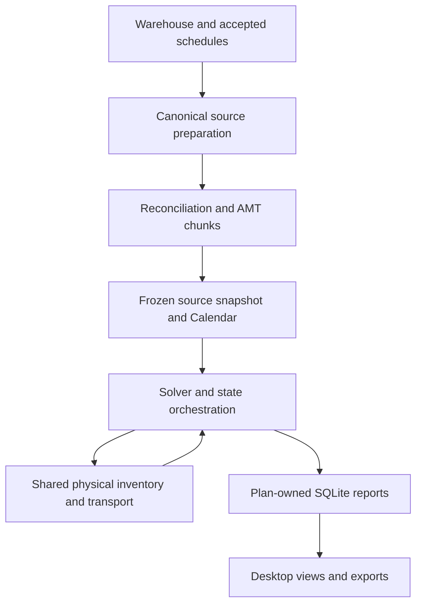

# 04 - Current Desktop Architecture and Extraction Boundaries

## Current runtime

BlendMaster is a Python 3.12 Windows application with a PyQt5 shell, local Plotly/Dash/Flask charts, pandas data preparation, SQLite report databases, Snowflake acquisition and PuLP/CBC optimisation. The environment requirements also contain development and other large packages; they are not a curated production-service dependency manifest.

`GUI/InitialiseGUI.py` remains a large orchestration and state controller. Many functions have been extracted, but workflow workers still rely on host state and methods. The current command-line workflow uses Qt and is not a headless Linux service.

## Module responsibility map

| Boundary | Current modules | Extraction implication |
| --- | --- | --- |
| Desktop workflow | InitialiseGUI, SiteAutomation, WorkflowPermissions, BackgroundTasks | Replace widgets/dialogs with application-service commands and events |
| Ingestion | OpeningStockpileInventories, ExpitDataHandler, GuidanceImport, setup/sql | Inject authenticated source adapters and immutable snapshot references |
| Canonical data | FieldDefinitions, SourcePropertyMappings, GradeStreams, DataLoader | Preserve typed field semantics and missing-data rules |
| AMT | AMTSpatialReconciliation, AMTGradeBlockLineage, AMTChunking | Pure transforms over prepared evidence plus audited geometry |
| Reconciliation | ReconciliationApplication, FactorResolver, ContinuousAssays, OPFSourceProfiles | Independent profile/estimator service with explicit inputs |
| Planning | execute/Run, CaseModeller, EventPoolGenerator, Optimizer, MultiLaneOptimizer | Job worker with solver subprocess control and cancellation |
| Physical state | BalanceTracker, ConveyorCOS, TransportPlanning, ProductBuildProgress | Preserve one transactional evolution of material/build state |
| Persistence | DatabaseContext, SQLiteDatabase, PlanningPersistence, SavedPlanStore | Separate run-owned storage from user configuration |
| Reports | SavedResultViews, OperationalBlendPlans, report exporters, DrawCharts | Query immutable results; never recalculate from current UI fields |
| Shared inputs | ScheduledSiteBatch, SharedProjects, WorkflowCheckpoint | Durable scheduler and revision-aware publication/merge service |

## Current data flow

Warehouse and accepted schedule inputs → explicit canonical mapping → reconciliation and AMT preparation → source snapshot → event pool and Calendar → solver decision → physical depletion/build/transport update → next state → plan-owned reports and audits → operational views and exports.

Single-point and simultaneous modes have different orchestration paths. A simultaneous solve shares physical availability across all tipping points and keeps OPF-specific chemistry. Do not independently replay each point using cloned stockpile balances.

Embedded chart servers bind process-local localhost ports. These enable desktop chart rendering; they are not an authenticated web application or approved public API. Report rows and chart content are derived from the active site's result database.

## Persistence and concurrency

The desktop project is a Python pickle containing configuration, scenario state and embedded database snapshots. Project format is 16, planning semantics version 1 and flow-layout version 1 at the reviewed baseline. Application version v0.3.326 is a separate identity.

Each scenario has its own database context. Workers capture site/database/input context and reject obsolete results. Saves and report publication use atomic replacement or database transactions. Input imports preserve accepted data until replacements validate. These protections are useful design precedents, but desktop state isolation does not prove multi-user isolation.

## Known extraction work

1. Define plain request/result types around preparation and planning. Remove method lookup against GUI host classes.
2. Replace dialogs, Qt signals, local file selectors and environment-derived roles at the service boundary.
3. Inject database, warehouse, clock, object-store, logger and solver interfaces.
4. Keep all mutation owned by one run context. Eliminate implicit current-site/global database dependencies in server workers.
5. Preserve numerical behaviour with differential fixtures before changing solver or data algorithms.
6. Move large audit frames outside frequently copied model objects. Measure peak memory and serialization cost.
7. Replace chart-server lifecycle management with web-native views over report endpoints.

The retained historical model is about 2.35 GB and earlier reopening took roughly 20 minutes; those are desktop observations requiring profiling, not web-service sizing. Packaging scripts include workstation-specific paths and need a reproducible build environment before release.

## Migration safety

Do not accept public .prj uploads and unpickle them in a service. Python's [pickle documentation](https://docs.python.org/3/library/pickle.html) explains that untrusted pickle can execute code. Convert approved legacy files through an isolated controlled migration process and validate their declarative output.

**Evidence:** [desktop controller](https://github.com/Arminium86/BlendMaster/blob/becfca8c84f3a5098fdf89d3880b687d80cde641/blendmaster_OOP/GUI/InitialiseGUI.py), [project preparation](https://github.com/Arminium86/BlendMaster/blob/becfca8c84f3a5098fdf89d3880b687d80cde641/blendmaster_OOP/GUI/ProjectLoading.py), [run entry](https://github.com/Arminium86/BlendMaster/blob/becfca8c84f3a5098fdf89d3880b687d80cde641/blendmaster_OOP/execute/Run.py), [database context](https://github.com/Arminium86/BlendMaster/blob/becfca8c84f3a5098fdf89d3880b687d80cde641/blendmaster_OOP/database/DatabaseContext.py), [saved results](https://github.com/Arminium86/BlendMaster/blob/becfca8c84f3a5098fdf89d3880b687d80cde641/blendmaster_OOP/classes/SavedPlanStore.py), [requirements](https://github.com/Arminium86/BlendMaster/blob/becfca8c84f3a5098fdf89d3880b687d80cde641/blendmaster_OOP/requirements.txt).
