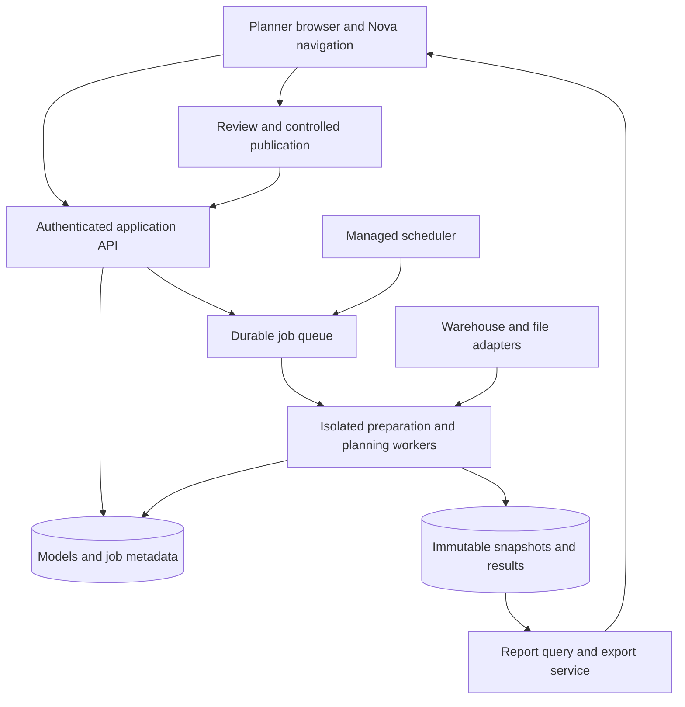

# 06 - Proposed Web Architecture and Nova Integration

## Decision status

This page proposes the production target; these services are not implemented by the desktop release. Nova was inspected on 14 September 2026. Its visible experience is an authenticated operations portal with Planning, Tonnes and Grades, Advanced Material Tracking, access/permissions and support surfaces. This supports investigating a Nova integration, but does **not** identify its hosting provider, deployment stack or integration contract.

Confirm the platform with the Nova owner before selecting AWS, Azure or another hosting environment. The application URL alone cannot establish the cloud provider. Use this [Nova entry point](https://nova.fortescue.com/#/) as the business integration reference.

## Recommended logical architecture

Browser / Nova navigation
→ authenticated application API
→ site configuration and revision store
→ durable job queue
→ isolated preparation/planning workers
→ immutable result datasets
→ query and report services
→ planner review and controlled publication.

Warehouse adapters and file-ingestion adapters feed versioned input snapshots. A scheduler submits the same application commands as an interactive user, with a service identity and site scope. Logs, metrics and audits span the complete run.

Start with a modular Python service and separate workers, rather than requiring many independently deployed microservices. Numerical/model code should be reusable without Qt. Long solver jobs must outlive browser connections and support status polling or progress events, cancellation and resource limits.

## Component contracts

| Component | Responsibility | Must not own |
| --- | --- | --- |
| Web UI | Planner decisions, maps, tables, comparisons and review | Warehouse credentials or authoritative calculations |
| Application API | Authentication, site authorization, schema checks, revision control | Long synchronous optimisation |
| Preparation worker | Fetch/validate sources and publish prepared snapshot | User session state |
| Planning worker | Solve frozen input revision and persist complete results | Mutable shared current-site globals |
| Metadata database | Models, jobs, permissions references, revisions and publication pointers | Multi-GB serialized GUI objects |
| Object storage | Accepted files, source snapshots, result partitions and exports | Implicit last-writer-wins plan identity |
| Report query service | Paginated reads and aggregates from a named result | Reinterpretation using current setup values |
| Scheduler | Site cadence, retries, leases and batch completion | Dependence on an open desktop window |

Use immutable run IDs and compare-and-swap publication pointers. Deduplicate job submissions with an idempotency key. Retried work must not duplicate observations, reports or published revisions. An older completed job may remain inspectable but must not overwrite a newer accepted revision.

## Conditional AWS mapping

If AWS is confirmed, containerized API/worker workloads could use ECS with approved compute capacity; [ECS supports services and tasks](https://docs.aws.amazon.com/AmazonECS/latest/developerguide/Welcome.html). Select instance/task sizing from measured memory, solver duration and concurrency.

An approved managed relational database can hold metadata; object storage can hold larger evidence and results. [S3 Versioning](https://docs.aws.amazon.com/AmazonS3/latest/userguide/Versioning.html) can retain object versions, but application-level publication still needs transactional revision checks. Use the platform's approved queue, scheduler, secrets, observability and deployment tooling.

These are candidate mappings, not procurement choices or confirmation that Nova uses AWS. Equivalent platform services can satisfy the same contracts. Avoid selecting a web-request timeout model for long planning jobs without workload evidence.

## Questions for the Nova/platform owner

Confirm the owning team, cloud/account/region, approved runtime, CI/CD and infrastructure standards; corporate identity provider and role claims; site authorization model; Snowflake connectivity and workload identity; network ingress/egress; file delivery interfaces; design system; whether BlendMaster is a linked app, route, embedded module or separately deployed service; and monitoring/support ownership.

Record each as an architecture decision with owner, alternatives, evidence and review date. Do not hard-code Nova shell internals before an integration contract is agreed.

## Production qualities and acceptance

Run APIs must be asynchronous, retry-safe and observable. Use service identities and least-privilege source access; enforce site permissions on reads, writes, exports and job actions. Upload limits, schema validation and controlled legacy conversion belong in the service. Preserve the current source evidence without exposing it through unauthenticated report URLs.

Agree latency, throughput, concurrent-user/run capacity, availability, recovery time and recovery point objectives with owners. Measure them on representative production data before setting capacity or cost estimates. Test failed workers, lost leases, duplicate jobs, partial uploads, database outage and rollback. No cloud deployment is authorized or performed as part of this documentation rewrite.
